# MostafaElzoghbey/wasalny-landing-page Wiki

Version: 1

## Overview

### Introduction & Project Scope

<details>
<summary>Relevant source files</summary>

The following files were used as context for generating this wiki page:

- [AGENTS.md](https://github.com/MostafaElzoghbey/wasalny-landing-page/blob/main/AGENTS.md)
- [package.json](https://github.com/MostafaElzoghbey/wasalny-landing-page/blob/main/package.json)
- [src/App.tsx](https://github.com/MostafaElzoghbey/wasalny-landing-page/blob/main/src/App.tsx)
- [src/data/content.ts](https://github.com/MostafaElzoghbey/wasalny-landing-page/blob/main/src/data/content.ts)
- [src/hooks/useAnimations.ts](https://github.com/MostafaElzoghbey/wasalny-landing-page/blob/main/src/hooks/useAnimations.ts)
- [src/index.css](https://github.com/MostafaElzoghbey/wasalny-landing-page/blob/main/src/index.css)
- [README.md](https://github.com/MostafaElzoghbey/wasalny-landing-page/blob/main/README.md)
</details>

# Introduction & Project Scope

Wasalny (وصلني) is a specialized landing page for a transportation service based in Damietta, Egypt. The project is designed as a high-performance, responsive web application that facilitates travel bookings between Damietta, Cairo, and major airports. It leverages modern web technologies to provide a smooth, animated user experience tailored for both desktop and mobile users in an Arabic (RTL) context.

The scope of the project encompasses service showcase, fleet categorization, route mapping, and lead generation via integrated communication channels like WhatsApp and direct calling. The architecture emphasizes a component-based design with a heavy focus on interactive visual storytelling through advanced animation hooks.

Sources: [AGENTS.md:5-9](), [src/data/content.ts:74-80]()

## Core Tech Stack

The application is built using a modern frontend stack focused on performance, type safety, and sophisticated UI interactions.

| Technology | Purpose | Key Details |
| :--- | :--- | :--- |
| **React 19** | UI Library | Uses function declarations and hooks |
| **TypeScript 5.9** | Language | Strict mode enabled, interface-driven |
| **Vite 7** | Build Tool | Fast HMR and production bundling |
| **Tailwind CSS v4** | Styling | Utility-first with CSS variable theming |
| **GSAP** | Animations | Includes ScrollTrigger and custom hooks |
| **Lenis** | UX | Smooth scrolling integration |
| **Lucide React** | Icons | SVG-based iconography |

Sources: [package.json:13-35](), [AGENTS.md:14-22]()

## System Architecture & Data Flow

The application follows a unidirectional data flow common in React ecosystems, where static content is centralized in data files and consumed by specialized UI sections.

### Component Hierarchy
The root of the application, `App.tsx`, serves as the orchestrator for global providers (Theme, Smooth Scroll) and high-level layout components (Header, Footer).

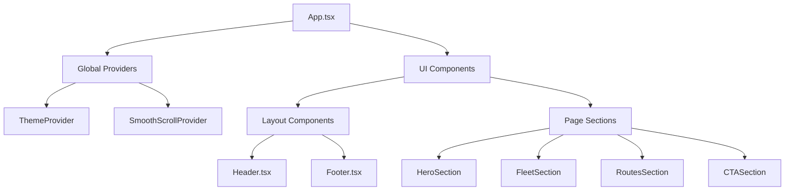
```mermaid
graph TD
    App[App.tsx] --> Providers[Global Providers]
    App --> UI[UI Components]
    
    Providers --> Theme[ThemeProvider]
    Providers --> Scroll[SmoothScrollProvider]
    
    UI --> Layout[Layout Components]
    UI --> Sections[Page Sections]
    
    Layout --> Header[Header.tsx]
    Layout --> Footer[Footer.tsx]
    
    Sections --> Hero[HeroSection]
    Sections --> Fleet[FleetSection]
    Sections --> Routes[RoutesSection]
    Sections --> CTA[CTASection]
```
Sources: [src/App.tsx:21-46](), [src/components/sections/index.ts:1-8]()

### Animation Logic Flow
Animations are decoupled from component logic using custom hooks. These hooks interface with GSAP and ScrollTrigger to drive visual updates based on user scroll position or interaction.

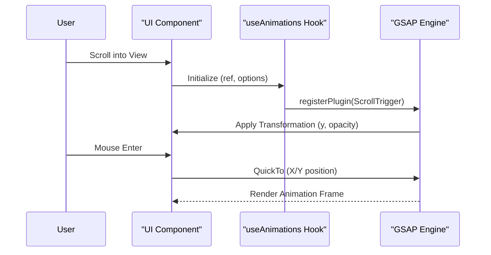
```mermaid
sequenceDiagram
    participant User
    participant Component as "UI Component"
    participant Hook as "useAnimations Hook"
    participant GSAP as "GSAP Engine"
    
    User->>Component: Scroll into View
    Component->>Hook: Initialize (ref, options)
    Hook->>GSAP: registerPlugin(ScrollTrigger)
    GSAP->>Component: Apply Transformation (y, opacity)
    User->>Component: Mouse Enter
    Component->>GSAP: QuickTo (X/Y position)
    GSAP-->>Component: Render Animation Frame
```
Sources: [src/hooks/useAnimations.ts:16-50](), [src/hooks/useAnimations.ts:114-142]()

## Project Organization

The repository is structured to separate concerns between business data, reusable UI elements, and complex animation logic.

### Directory Structure
*   `src/components/sections/`: Contains the primary visual blocks of the landing page (e.g., `HeroSection`, `FleetSection`).
*   `src/hooks/`: Houses `useAnimations.ts`, which provides reusable GSAP logic such as `useTextReveal` and `useBatchReveal`.
*   `src/data/`: Centralizes site content like `routes`, `stats`, and `contactInfo`.
*   `src/lib/`: Utility configurations for GSAP and Tailwind merging.

Sources: [AGENTS.md:25-36](), [src/data/content.ts:1-80]()

## Visual Identity & Theming

The project uses a custom color palette defined in `index.css` via the Tailwind CSS v4 `@theme` directive. It supports both light and dark modes through CSS variables.

### Primary Color Variables
*   **Primary Blue**: Range from `primary-50` (#eff6ff) to `primary-950` (#172554), representing the core brand identity.
*   **Accent Orange**: Extracted from the logo (`accent-400` to `accent-600`) for call-to-action elements.
*   **Typography**: Uses the 'Cairo' font family to support Arabic legibility.

Sources: [src/index.css:7-35](), [src/index.css:127-133]()

## Functional Scope

The landing page provides several key functionalities aimed at user engagement:

1.  **Lead Generation**: Integration with WhatsApp and direct phone calling for immediate booking.
2.  **Fleet Information**: Categorized display of vehicles (Sedan, SUV, Family Cruiser, Minibus) with passenger capacity and features.
3.  **Route Mapping**: Visual representation of travel paths between Damietta, Cairo, and the Airport.
4.  **Social Proof**: Display of statistics (3000+ Happy Customers, 5000+ Successful Trips).

Sources: [src/data/content.ts:68-72](), [src/data/content.ts:50-57](), [src/components/sections/HeroSection.tsx:142-154]()

# Conclusion
The Wasalny Landing Page is a technically robust React application designed for high-end user engagement. By combining strict TypeScript typing with a modular animation system, the project ensures maintainability while delivering a premium visual experience for the Damietta-Cairo transportation market.

### Getting Started & Installation

<details>
<summary>Relevant source files</summary>

The following files were used as context for generating this wiki page:

- [package.json](https://github.com/MostafaElzoghbey/wasalny-landing-page/blob/main/package.json)
- [AGENTS.md](https://github.com/MostafaElzoghbey/wasalny-landing-page/blob/main/AGENTS.md)
- [README.md](https://github.com/MostafaElzoghbey/wasalny-landing-page/blob/main/README.md)
- [src/App.tsx](https://github.com/MostafaElzoghbey/wasalny-landing-page/blob/main/src/App.tsx)
- [src/index.css](https://github.com/MostafaElzoghbey/wasalny-landing-page/blob/main/src/index.css)
- [src/lib/gsap.ts](https://github.com/MostafaElzoghbey/wasalny-landing-page/blob/main/src/lib/gsap.ts)
</details>

# Getting Started & Installation

This document provides a technical overview of how to set up, install, and begin development on the Wasalny landing page project. Wasalny is a specialized transportation service platform based in Damietta, Egypt, focusing on routes to Cairo and various airports. The project is built using modern web technologies including React 19, TypeScript, and Vite, with a heavy emphasis on high-performance animations via GSAP and smooth scrolling through Lenis.

The development environment is optimized for a fast developer experience (DX) using Vite's Hot Module Replacement (HMR) and a strict TypeScript configuration to ensure type safety across the component architecture.

Sources: [AGENTS.md:3-8](), [package.json:13-22]()

## Tech Stack Overview

The project utilizes a modern frontend stack designed for performance, maintainability, and advanced UI/UX interactions.

| Technology | Purpose | Version |
| :--- | :--- | :--- |
| **React** | Component-based UI library | ^19.2.0 |
| **TypeScript** | Static typing and tooling | ~5.9.3 |
| **Vite** | Build tool and dev server | ^7.2.4 |
| **Tailwind CSS** | Utility-first styling (v4) | ^4.1.6 |
| **GSAP** | High-performance animations | ^3.14.2 |
| **Lenis** | Smooth scrolling engine | ^1.3.17 |

Sources: [package.json:13-37](), [AGENTS.md:14-22]()

## Prerequisites & Installation

To get started with the project, ensure you have Node.js installed. The project uses `npm` as the primary package manager.

### Step 1: Clone and Install
First, clone the repository and install the necessary dependencies:

```bash
npm install
```

### Step 2: Available Commands
The `package.json` defines several scripts to manage the development lifecycle:

| Command | Action |
| :--- | :--- |
| `npm run dev` | Starts the Vite development server with HMR. |
| `npm run build` | Runs the TypeScript compiler (`tsc -b`) followed by the Vite production build. |
| `npm run lint` | Executes ESLint to check for code quality and style violations. |
| `npm run preview` | Previews the locally built production files. |

Sources: [package.json:7-12](), [AGENTS.md:24-33]()

## Project Architecture & Flow

The application initializes through a standard Vite-React entry point, but incorporates several providers to manage theme, smooth scrolling, and animation registration.

### Bootstrapping Process
The following diagram illustrates the initialization flow of the application from the entry point to the rendered sections:

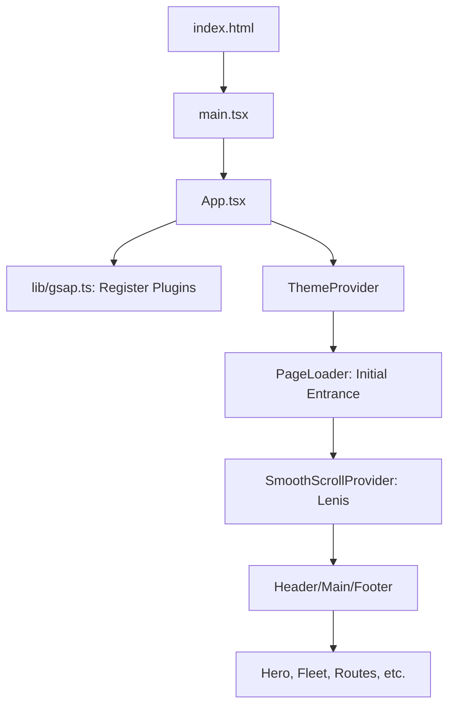
```mermaid
graph TD
    Entry[index.html] --> Main[main.tsx]
    Main --> App[App.tsx]
    App --> GSAP_Config[lib/gsap.ts: Register Plugins]
    App --> Theme[ThemeProvider]
    Theme --> Loader[PageLoader: Initial Entrance]
    Loader --> Scroll[SmoothScrollProvider: Lenis]
    Scroll --> Layout[Header/Main/Footer]
    Layout --> Sections[Hero, Fleet, Routes, etc.]
```
The application flow ensures that animation plugins are registered before components mount.
Sources: [src/App.tsx:21-46](), [src/lib/gsap.ts:5-7]()

### Key Component Structure
The project follows a modular structure where UI components are separated from section-specific logic:

- `src/components/layout/`: Persistent elements like `Header` and `Footer`.
- `src/components/sections/`: High-level page blocks (e.g., `HeroSection.tsx`, `FleetSection.tsx`).
- `src/components/ui/`: Reusable, atomic components like `Button.tsx` or `PageLoader.tsx`.
- `src/lib/`: Core utility configurations, specifically for `gsap.ts`.

Sources: [AGENTS.md:37-48]()

## Core Development Guidelines

### Animation Integration
Animations are handled centrally using GSAP. Developers must use the `useGSAP` hook for React integration to ensure proper cleanup and performance.

```typescript
import { useGSAP } from '@gsap/react';
import gsap from 'gsap';

useGSAP(() => {
  gsap.to(".element", { opacity: 1 });
}, { scope: containerRef });
```
Sources: [src/lib/gsap.ts:1-7](), [AGENTS.md:83-93]()

### RTL (Right-to-Left) Support
As the target audience is Arabic-speaking, the project includes specific helpers in `src/lib/gsap.ts` to handle coordinate systems in RTL layouts. The `rtlX` utility negates X-axis values if the document direction is set to 'rtl'.

```typescript
// From src/lib/gsap.ts
export const rtlX = (value: number): number => {
  if (typeof document === 'undefined') return value;
  return document.dir === 'rtl' ? -value : value;
};
```
Sources: [src/lib/gsap.ts:16-19](), [AGENTS.md:118-125]()

### Styling System
The project utilizes Tailwind CSS v4 via the `@tailwindcss/vite` plugin. Custom theme variables (like primary colors and custom animations) are defined in the `@theme` block within `src/index.css`.

Sources: [src/index.css:7-35](), [package.json:25]()

## Summary
To begin development, run `npm install` followed by `npm run dev`. The project relies on a strictly typed TypeScript environment and a specific animation workflow utilizing GSAP and Lenis. Developers should adhere to the RTL utility helpers when implementing horizontal animations to ensure consistency across the Arabic interface.

### Technology Stack

<details>
<summary>Relevant source files</summary>

The following files were used as context for generating this wiki page:

- [AGENTS.md](https://github.com/MostafaElzoghbey/wasalny-landing-page/blob/main/AGENTS.md)
- [package.json](https://github.com/MostafaElzoghbey/wasalny-landing-page/blob/main/package.json)
- [tsconfig.app.json](https://github.com/MostafaElzoghbey/wasalny-landing-page/blob/main/tsconfig.app.json)
- [src/index.css](https://github.com/MostafaElzoghbey/wasalny-landing-page/blob/main/src/index.css)
- [src/App.tsx](https://github.com/MostafaElzoghbey/wasalny-landing-page/blob/main/src/App.tsx)
- [src/components/ui/SectionHeading.tsx](https://github.com/MostafaElzoghbey/wasalny-landing-page/blob/main/src/components/ui/SectionHeading.tsx)
- [src/components/sections/HeroSection.tsx](https://github.com/MostafaElzoghbey/wasalny-landing-page/blob/main/src/components/sections/HeroSection.tsx)
</details>

# Technology Stack

The Wasalny landing page is built using a modern frontend architecture centered around **React 19** and **TypeScript**. It serves as a high-performance, visually engaging landing page for a transportation service in Damietta, Egypt. The stack is specifically chosen to support complex animations, smooth scrolling, and a responsive utility-first design suitable for both right-to-left (RTL) and left-to-right (LTR) contexts.

The project leverages **Vite** as the build tool and development server, ensuring fast Hot Module Replacement (HMR) and optimized production builds. Styling is handled via **Tailwind CSS v4**, while the interactive experience is powered by the **GreenSock Animation Platform (GSAP)** and **Lenis** for smooth scroll behavior.

Sources: [AGENTS.md:5-10](), [package.json:15-20]()

## Core Framework and Language

The application's foundation is built on React 19, utilizing functional components and modern hooks for state and lifecycle management. TypeScript is employed across the codebase to ensure type safety, particularly for component props, animation configurations, and data structures.

### Key Specifications
| Technology | Version | Description |
| :--- | :--- | :--- |
| **React** | ^19.2.0 | Core UI framework for component-based architecture. |
| **TypeScript** | ~5.9.3 | Static typing with strict mode enabled. |
| **Vite** | ^7.2.4 | Build tool and dev server with React plugin. |

Sources: [package.json:15-32](), [tsconfig.app.json:4-15]()

## Animation and Interactivity Engine

The visual identity of the project is heavily dependent on the **GSAP** suite. The implementation uses a centralized configuration in `src/lib/gsap.ts` and leverages the `@gsap/react` hook for safe integration with the React lifecycle.

### Animation Components
*   **GSAP Core & Plugins**: Used for timeline-based animations, including `ScrollTrigger` for scroll-activated effects.
*   **Custom Animation Hooks**: The project abstracts complex GSAP logic into reusable hooks like `useTextReveal`, `useFloatingAnimation`, and `useParallax`.
*   **Split-Type**: A utility used to split text into characters or words for granular reveal animations.

The following diagram illustrates the flow of a scroll-triggered animation within a component like `SectionHeading`.

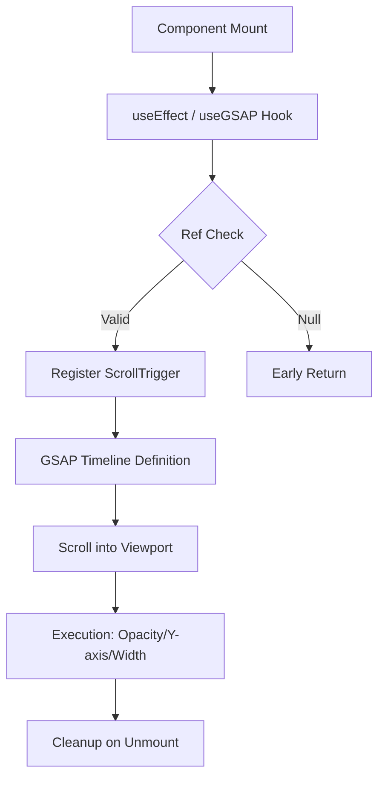
```mermaid
flowchart TD
    A[Component Mount] --> B[useEffect / useGSAP Hook]
    B --> C{Ref Check}
    C -- Valid --> D[Register ScrollTrigger]
    C -- Null --> E[Early Return]
    D --> F[GSAP Timeline Definition]
    F --> G[Scroll into Viewport]
    G --> H[Execution: Opacity/Y-axis/Width]
    H --> I[Cleanup on Unmount]
```
The diagram shows how the component lifecycle interacts with the GSAP engine to trigger animations based on viewport position.
Sources: [src/components/ui/SectionHeading.tsx:23-60](), [AGENTS.md:79-92](), [package.json:16-22]()

## Styling and Layout Architecture

The project uses **Tailwind CSS v4** with a customized theme configuration. The styling architecture is designed to support dark mode and RTL layouts natively.

### CSS Architecture
*   **Utility-First**: Styles are applied primarily through Tailwind classes in JSX.
*   **Semantic Tokens**: Custom CSS variables are defined in `@layer base` for both light and dark themes (e.g., `--background`, `--primary-500`).
*   **Component Classes**: Common UI elements like `.btn-primary` and `.card` are abstracted using the `@layer components` directive.

### Theme Configuration Example
```css
@theme {
  --color-primary-500: #3b82f6;
  --color-accent-500: #f97316;
  --animate-float: float 3s ease-in-out infinite;
  --font-cairo: 'Cairo', sans-serif;
}
```
Sources: [src/index.css:7-38](), [src/index.css:122-156]()

## Project Structure and Dependencies

The application is organized into a modular directory structure to separate concerns between UI, logic, and data.

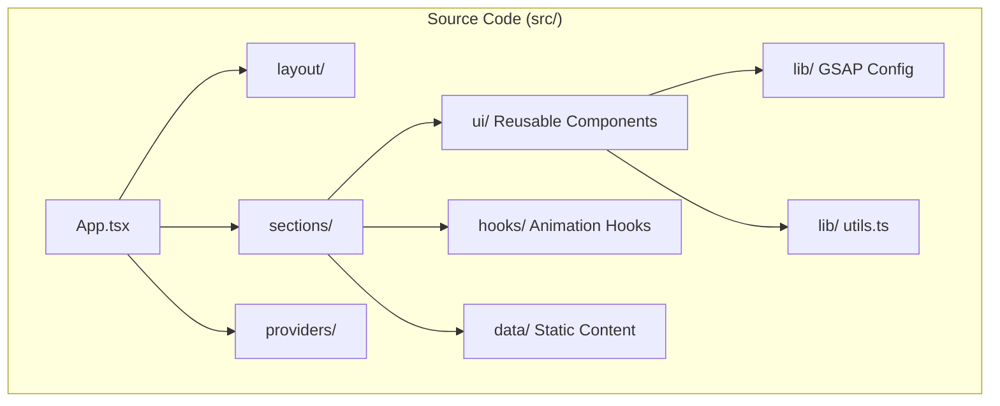
```mermaid
graph TD
    subgraph "Source Code (src/)"
        App[App.tsx] --> Layout[layout/]
        App --> Sections[sections/]
        App --> Providers[providers/]
        
        Sections --> UI[ui/ Reusable Components]
        Sections --> Hooks[hooks/ Animation Hooks]
        
        UI --> Lib[lib/ GSAP Config]
        UI --> Utils[lib/ utils.ts]
        
        Sections --> Data[data/ Static Content]
    end
```
This graph represents the high-level dependency flow where the main App entry point composes layout and section components.
Sources: [AGENTS.md:23-34](), [src/App.tsx:15-40]()

### Utility Libraries
*   **lucide-react**: Provides a consistent set of SVG icons used across Hero, Features, and Contact sections.
*   **clsx & tailwind-merge**: Combined in a `cn()` utility to handle conditional class merging without conflicts.
*   **Lenis**: Integrated via a `SmoothScrollProvider` to normalize scrolling behavior across different browsers and devices.

Sources: [package.json:17-23](), [src/App.tsx:31-35](), [AGENTS.md:72-77]()

## Development Workflow

The project maintains a strict development environment through ESLint and TypeScript configurations.

| Command | Action |
| :--- | :--- |
| `npm run dev` | Starts the Vite development server with HMR. |
| `npm run build` | Runs `tsc` for type checking followed by `vite build` for production assets. |
| `npm run lint` | Executes ESLint to enforce code style and catch potential errors. |

Sources: [package.json:7-12](), [AGENTS.md:12-21]()

## Conclusion

The Wasalny landing page technology stack is a performance-oriented suite that prioritizes user experience through smooth transitions and a robust design system. By combining React 19's rendering efficiency with GSAP's powerful animation capabilities and Tailwind CSS's flexible styling, the architecture ensures a highly maintainable and scalable frontend codebase.


## System Architecture

### Project Structure & Organization

<details>
<summary>Relevant source files</summary>

The following files were used as context for generating this wiki page:

- [AGENTS.md](https://github.com/MostafaElzoghbey/wasalny-landing-page/blob/main/AGENTS.md)
- [package.json](https://github.com/MostafaElzoghbey/wasalny-landing-page/blob/main/package.json)
- [src/App.tsx](https://github.com/MostafaElzoghbey/wasalny-landing-page/blob/main/src/App.tsx)
- [src/components/sections/index.ts](https://github.com/MostafaElzoghbey/wasalny-landing-page/blob/main/src/components/sections/index.ts)
- [src/index.css](https://github.com/MostafaElzoghbey/wasalny-landing-page/blob/main/src/index.css)
- [src/data/content.ts](https://github.com/MostafaElzoghbey/wasalny-landing-page/blob/main/src/data/content.ts)
- [src/components/layout/Header.tsx](https://github.com/MostafaElzoghbey/wasalny-landing-page/blob/main/src/components/layout/Header.tsx)
</details>

# Project Structure & Organization

The Wasalny Landing Page project is built using a modern React 19 and TypeScript stack, orchestrated by the Vite build tool. The project follows a modular architecture designed to support a high-performance, animated landing page for a transportation service. It leverages GSAP for complex animations, Tailwind CSS v4 for styling, and Lenis for smooth scrolling integration.

The organization is strictly component-based, separating concerns between layout elements, reusable UI primitives, and page-specific sections. This structure ensures scalability and maintainability while specifically catering to an Arabic (RTL) user interface.

Sources: [AGENTS.md:1-12](), [package.json:1-40](), [src/App.tsx:1-48]()

## Tech Stack & Core Dependencies

The project utilizes a specific set of libraries to handle performance, animations, and styling requirements.

| Category | Technology |
| :--- | :--- |
| **Framework** | React 19 + TypeScript 5.9 |
| **Build Tool** | Vite 7 |
| **Styling** | Tailwind CSS v4 |
| **Animations** | GSAP, @gsap/react, Split-type |
| **Scrolling** | Lenis |
| **Icons** | Lucide React |

Sources: [AGENTS.md:14-22](), [package.json:12-38]()

## Directory Organization

The codebase is organized into a clean directory structure within the `src/` folder to maintain clear separation of concerns.

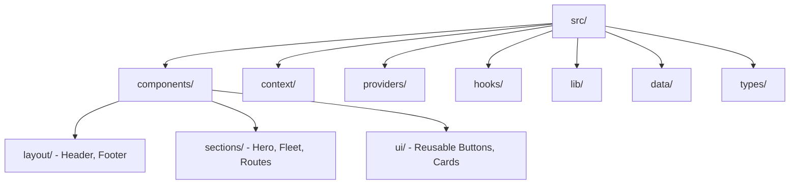
```mermaid
graph TD
    Root[src/] --> Components[components/]
    Root --> Context[context/]
    Root --> Providers[providers/]
    Root --> Hooks[hooks/]
    Root --> Lib[lib/]
    Root --> Data[data/]
    Root --> Types[types/]
    
    Components --> Layout[layout/ - Header, Footer]
    Components --> Sections[sections/ - Hero, Fleet, Routes]
    Components --> UI[ui/ - Reusable Buttons, Cards]
```
*The diagram above illustrates the logical grouping of files and directories within the source folder.*

### Directory Definitions
*   **components/**: Contains all React components. It is subdivided into `layout` (persistent elements like Header), `sections` (individual landing page blocks), and `ui` (atomic, reusable elements).
*   **data/**: Holds static content and configuration, such as car image mappings and text content for the Arabic interface.
*   **hooks/**: Custom React hooks, primarily focused on GSAP animation abstractions like `useTextReveal` and `useParallax`.
*   **lib/**: Utility configurations, specifically the GSAP plugin registration and Tailwind `cn()` utility.
*   **providers/**: Context providers for global features like smooth scrolling (Lenis).

Sources: [AGENTS.md:24-38](), [src/App.tsx:1-20]()

## Component Architecture & Data Flow

The application follows a unidirectional data flow and a hierarchical component structure. The entry point, `App.tsx`, wraps the entire application in necessary providers and assembles the sections into a single-page layout.

### Application Lifecycle and Loading
The system implements a `PageLoader` to manage the initial user experience while heavy assets or animations are initialized.

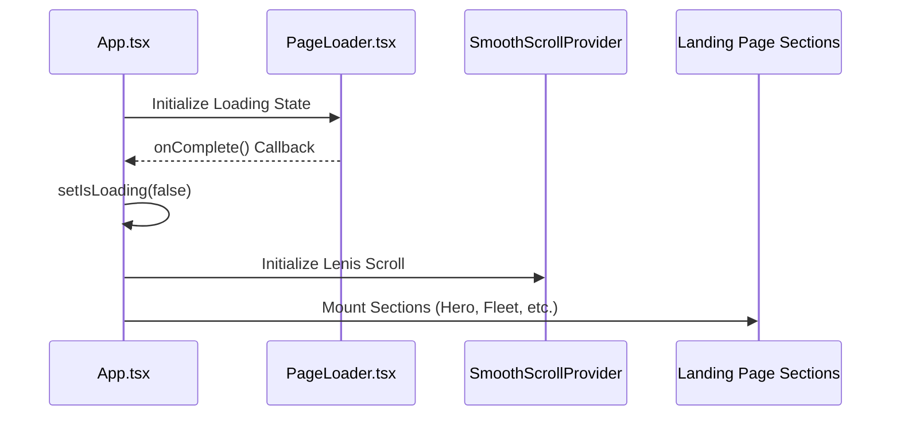
```mermaid
sequenceDiagram
    participant App as App.tsx
    participant Loader as PageLoader.tsx
    participant Smooth as SmoothScrollProvider
    participant Section as Landing Page Sections
    
    App->>Loader: Initialize Loading State
    Loader-->>App: onComplete() Callback
    App->>App: setIsLoading(false)
    App->>Smooth: Initialize Lenis Scroll
    App->>Section: Mount Sections (Hero, Fleet, etc.)
```
*This sequence shows the progression from the initial loading state to the mounting of interactive page sections.*

Sources: [src/App.tsx:23-46](), [src/components/ui/PageLoader.tsx:16-56]()

## Styling and Theming System

The project utilizes Tailwind CSS v4 with a custom theme defined in `src/index.css`. It supports both Light and Dark modes using CSS variables and semantic tokens.

*   **Primary Palette**: A blue-based palette (`--color-primary-50` to `--color-primary-950`).
*   **Accent Palette**: An orange/amber palette (`--color-accent-400` to `--color-accent-600`) derived from the company logo.
*   **Dark Mode**: Implemented via the `dark:` variant and class-based selector toggling.
*   **Animations**: Custom keyframes like `float`, `slideUp`, and `carDrive` are registered within the CSS `@theme` block.

Sources: [src/index.css:1-120](), [src/App.tsx:25-27]()

## Development Workflow & Guidelines

The project enforces strict coding standards to ensure consistency across the development team:

1.  **Imports**: Ordered by React, Third-party, Path Aliases (`@/*`), Relative imports, and CSS.
2.  **Naming**: PascalCase for Components, camelCase for hooks and utilities.
3.  **RTL Support**: Since the target language is Arabic, the project uses a specialized `rtlX` helper in GSAP configurations to negate X-axis values for right-to-left layout consistency.
4.  **Barrel Exports**: The `src/components/sections/` directory uses an `index.ts` file to export all sections, simplifying imports in the main `App.tsx`.

Sources: [AGENTS.md:40-104](), [src/components/sections/index.ts:1-10]()

## Conclusion
The project structure of Wasalny Landing Page is designed for high-performance visual storytelling. By leveraging a strict directory hierarchy, centralized data management in the `data/` folder, and a robust animation hook system, the architecture ensures that complex GSAP transitions remain maintainable and integrated within the React component lifecycle.

### State Management Strategy

<details>
<summary>Relevant source files</summary>

The following files were used as context for generating this wiki page:

- [src/context/ThemeContext.tsx](https://github.com/MostafaElzoghbey/wasalny-landing-page/blob/main/src/context/ThemeContext.tsx)
- [src/hooks/usePricingCalculator.ts](https://github.com/MostafaElzoghbey/wasalny-landing-page/blob/main/src/hooks/usePricingCalculator.ts)
- [src/App.tsx](https://github.com/MostafaElzoghbey/wasalny-landing-page/blob/main/src/App.tsx)
- [src/components/ui/PageLoader.tsx](https://github.com/MostafaElzoghbey/wasalny-landing-page/blob/main/src/components/ui/PageLoader.tsx)
- [src/components/sections/PricingCalculator.tsx](https://github.com/MostafaElzoghbey/wasalny-landing-page/blob/main/src/components/sections/PricingCalculator.tsx)
- [src/components/ui/FloatingCTA.tsx](https://github.com/MostafaElzoghbey/wasalny-landing-page/blob/main/src/components/ui/FloatingCTA.tsx)
</details>

# State Management Strategy

The Wasalny landing page employs a multi-layered state management strategy designed for a high-performance React 19 application. It leverages localized component state, custom hooks for complex business logic, and React Context for global UI settings like theming.

The strategy focuses on maintaining reactivity across interactive components—such as the pricing calculator and theme switcher—while ensuring persistence through browser storage where necessary.

## Global State: Theme Management

Global state is primarily managed using the React Context API to handle the application's visual theme. This ensures that the user's preference (light, dark, or system) is accessible throughout the component tree without prop drilling.

### ThemeContext Architecture
The `ThemeContext` provides three key values: the current `theme` setting, a `setTheme` function, and a `resolvedTheme` (which translates 'system' into either 'light' or 'dark').

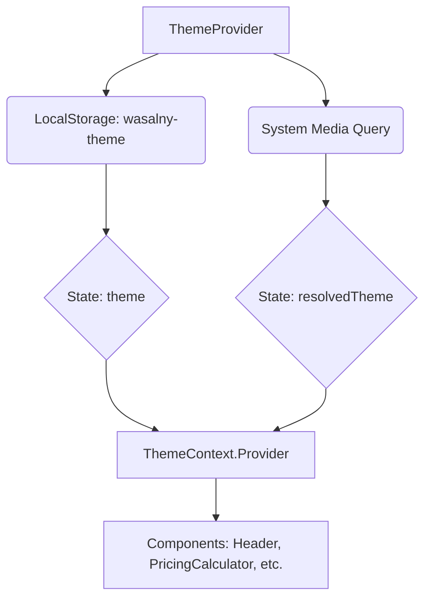
```mermaid
graph TD
    A[ThemeProvider] --> B(LocalStorage: wasalny-theme)
    A --> C(System Media Query)
    B --> D{State: theme}
    C --> E{State: resolvedTheme}
    D --> F[ThemeContext.Provider]
    E --> F
    F --> G[Components: Header, PricingCalculator, etc.]
```
The implementation uses a `useCallback` to apply CSS classes to the document root, ensuring that Tailwind's `dark:` variants are triggered correctly.

Sources: [src/context/ThemeContext.tsx:1-60](), [src/App.tsx:25-50]()

## Local and Persistent Business Logic: Pricing Calculator

The most complex state management occurs within the pricing calculator. This is handled via a custom hook, `usePricingCalculator`, which orchestrates UI state, derived computations, and persistence to `localStorage`.

### Data Flow and Synchronization
The calculator manages multiple interdependent state variables, such as route types, locations, and passenger counts. It uses `useEffect` hooks to synchronize these values (e.g., resetting "To" locations if the "From" location changes).

| State Property | Description | Persistence |
| :--- | :--- | :--- |
| `routeType` | 'travel' or 'internal' | Yes |
| `vehicleCategory` | Selected vehicle type | Yes |
| `passengerCount` | Number of passengers | Yes |
| `fromLocation` | Starting point ID | No |
| `toLocation` | Destination ID | No |
| `isRoundTrip` | Toggle for return trip | No |

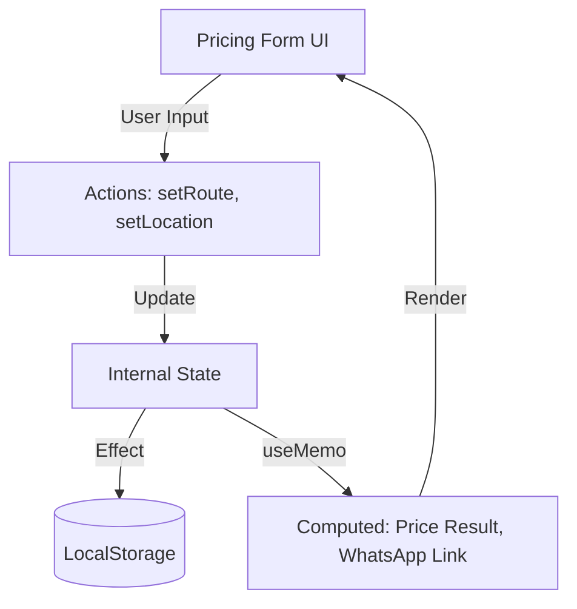
```mermaid
flowchart TD
    UI[Pricing Form UI] -->|User Input| Actions[Actions: setRoute, setLocation]
    Actions -->|Update| State[Internal State]
    State -->|Effect| Persistence[(LocalStorage)]
    State -->|useMemo| Computed[Computed: Price Result, WhatsApp Link]
    Computed -->|Render| UI
```
Sources: [src/hooks/usePricingCalculator.ts:15-100](), [src/components/sections/PricingCalculator.tsx:20-50]()

## Lifecycle and UI State

The application manages ephemeral UI states such as loading transitions and visibility triggers for floating elements.

### Loading State
The `App` component maintains an `isLoading` state which controls the display of the `PageLoader`. This state is updated via a callback passed to the loader component once its GSAP animations complete.

### Scroll-Triggered Visibility
Components like the `FloatingCTA` manage their own visibility state by listening to scroll events via `ScrollTrigger`. This allows the UI to react to the user's position on the page without cluttering the global state.

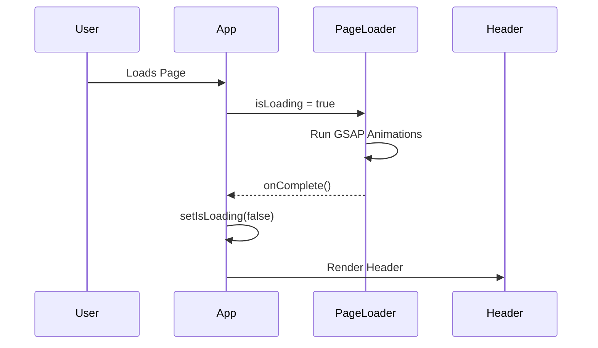
```mermaid
sequenceDiagram
    participant User
    participant App
    participant PageLoader
    participant Header
    
    User->>App: Loads Page
    App->>PageLoader: isLoading = true
    PageLoader->>PageLoader: Run GSAP Animations
    PageLoader-->>App: onComplete()
    App->>App: setIsLoading(false)
    App->>Header: Render Header
```
Sources: [src/App.tsx:28-35](), [src/components/ui/PageLoader.tsx:18-40](), [src/components/ui/FloatingCTA.tsx:15-30]()

## Persistence Strategy

Persistence is utilized to enhance user experience by remembering preferences across sessions. 

1.  **Theme Persistence:** Stored under the key `wasalny-theme`. It is initialized during the state setup in `ThemeContext`.
2.  **Calculator Persistence:** Stored under `wasalny_pricing_v2`. The `usePricingCalculator` hook loads this state on mount and saves it whenever relevant configuration values (route, vehicle, passengers) change.

Sources: [src/context/ThemeContext.tsx:16-25](), [src/hooks/usePricingCalculator.ts:102-125]()

## Summary

The project utilizes a decentralized state management approach. **React Context** handles cross-cutting concerns like UI theming. **Custom Hooks** encapsulate complex business logic and computation for the pricing system. **GSAP/ScrollTrigger** managed states handle the interactive visual lifecycle of the landing page, ensuring that state changes are fluid and performant.

### TypeScript Configuration

<details>
<summary>Relevant source files</summary>

The following files were used as context for generating this wiki page:

- [tsconfig.json](https://github.com/MostafaElzoghbey/wasalny-landing-page/blob/main/tsconfig.json)
- [tsconfig.app.json](https://github.com/MostafaElzoghbey/wasalny-landing-page/blob/main/tsconfig.app.json)
- [tsconfig.node.json](https://github.com/MostafaElzoghbey/wasalny-landing-page/blob/main/tsconfig.node.json)
- [package.json](https://github.com/MostafaElzoghbey/wasalny-landing-page/blob/main/package.json)
- [vite.config.ts](https://github.com/MostafaElzoghbey/wasalny-landing-page/blob/main/vite.config.ts)
- [AGENTS.md](https://github.com/MostafaElzoghbey/wasalny-landing-page/blob/main/AGENTS.md)
- [eslint.config.js](https://github.com/MostafaElzoghbey/wasalny-landing-page/blob/main/eslint.config.js)
</details>

# TypeScript Configuration

The TypeScript configuration for the Wasalny landing page project is designed to provide a robust, type-safe environment for a modern React 19 and Vite-based application. It employs a modular architecture using Project References to separate the concerns of the application code from the build tool configuration.

The configuration enforces strict type-checking and modern ECMAScript standards (ES2022/ES2023) to ensure high code quality and compatibility with contemporary browser environments. It also integrates path aliases to simplify imports across the project structure.
Sources: [tsconfig.json](), [tsconfig.app.json](), [AGENTS.md:38-40]()

## Configuration Architecture

The project utilizes a base `tsconfig.json` that acts as an entry point, delegating specific configurations to specialized files via the `references` property. This structure allows the TypeScript compiler (`tsc`) to handle the application logic and the build tool configuration (Vite) independently.

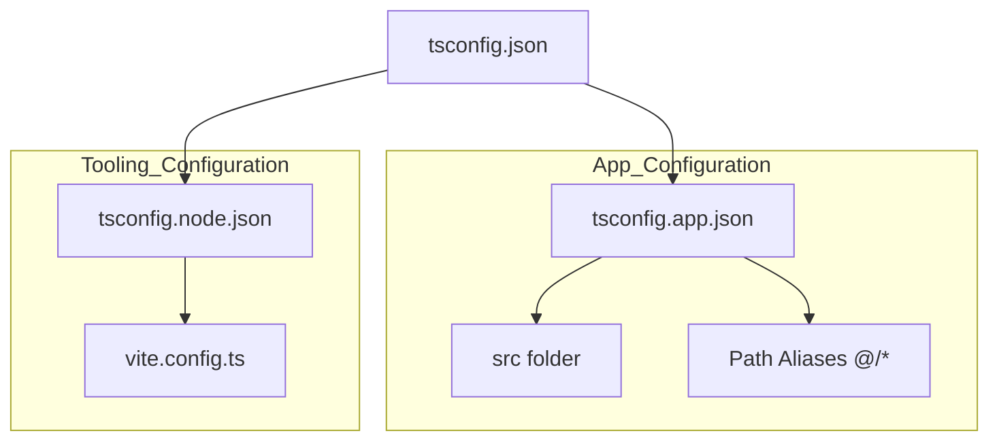
```mermaid
flowchart TD
    Root[tsconfig.json] --> AppRef[tsconfig.app.json]
    Root --> NodeRef[tsconfig.node.json]
    
    subgraph App_Configuration
    AppRef --> Source[src folder]
    AppRef --> Aliases[Path Aliases @/*]
    end
    
    subgraph Tooling_Configuration
    NodeRef --> ViteConfig[vite.config.ts]
    end
```
This diagram illustrates the hierarchical relationship between the root configuration and its referenced sub-configurations.
Sources: [tsconfig.json:3-6](), [tsconfig.app.json:36](), [tsconfig.node.json:25]()

## Core Configuration Files

### Root Configuration (`tsconfig.json`)
The root file serves purely as a coordinator. It contains an empty `files` array, indicating it does not compile files itself, but instead relies on the defined references.
Sources: [tsconfig.json:1-7]()

### Application Configuration (`tsconfig.app.json`)
This file governs the compilation of the main React application located in the `src` directory. It targets `ES2022` and uses `react-jsx` for JSX transformation.

| Category | Option | Value | Description |
| :--- | :--- | :--- | :--- |
| **Compilation** | `target` | `ES2022` | Modern JS output target |
| **Compilation** | `lib` | `["ES2022", "DOM", "DOM.Iterable"]` | Included library APIs |
| **Module System**| `module` | `ESNext` | Modern ESM module output |
| **Module System**| `moduleResolution` | `bundler` | Optimized for Vite/Bundlers |
| **Strictness** | `strict` | `true` | Enables all strict type-checking |
| **Strictness** | `noUnusedLocals` | `true` | Error on unused local variables |

Sources: [tsconfig.app.json:4-10](), [tsconfig.app.json:13-20](), [tsconfig.app.json:23-24]()

### Node/Tooling Configuration (`tsconfig.node.json`)
Dedicated to the environment where Vite runs. It targets `ES2023` and includes the `node` types to support build-time scripts like `vite.config.ts`.
Sources: [tsconfig.node.json:4-8](), [tsconfig.node.json:25]()

## Path Aliases and Module Resolution

The project uses path aliases to avoid deeply nested relative imports (e.g., `../../../`). These aliases are defined in the TypeScript configuration and must be mirrored in the Vite configuration to ensure both the compiler and the bundler can resolve files correctly.

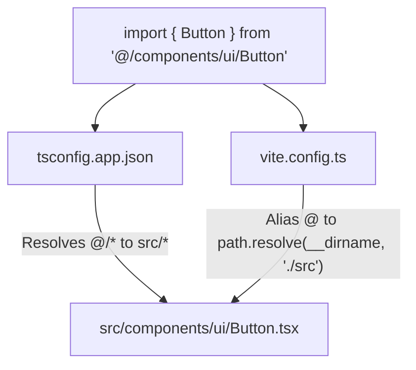
```mermaid
graph TD
    Import["import { Button } from '@/components/ui/Button'"]
    TS[tsconfig.app.json]
    Vite[vite.config.ts]
    Actual[src/components/ui/Button.tsx]

    Import --> TS
    TS -- "Resolves @/* to src/*" --> Actual
    Import --> Vite
    Vite -- "Alias @ to path.resolve(__dirname, './src')" --> Actual
```
The relationship between TypeScript aliases and Vite resolution.
Sources: [tsconfig.app.json:31-34](), [vite.config.ts:10-14]()

### Defined Aliases
| Alias | Target Path | Usage Example |
| :--- | :--- | :--- |
| `@/*` | `src/*` | `import { cn } from '@/lib/utils'` |
| `@assets/*` | `assets/*` | `import logo from '@assets/logo.svg'` |

Sources: [tsconfig.app.json:32-33](), [AGENTS.md:49-55]()

## TypeScript Integration in Build Pipeline

TypeScript is integrated into the project's development and build lifecycle via NPM scripts and ESLint.

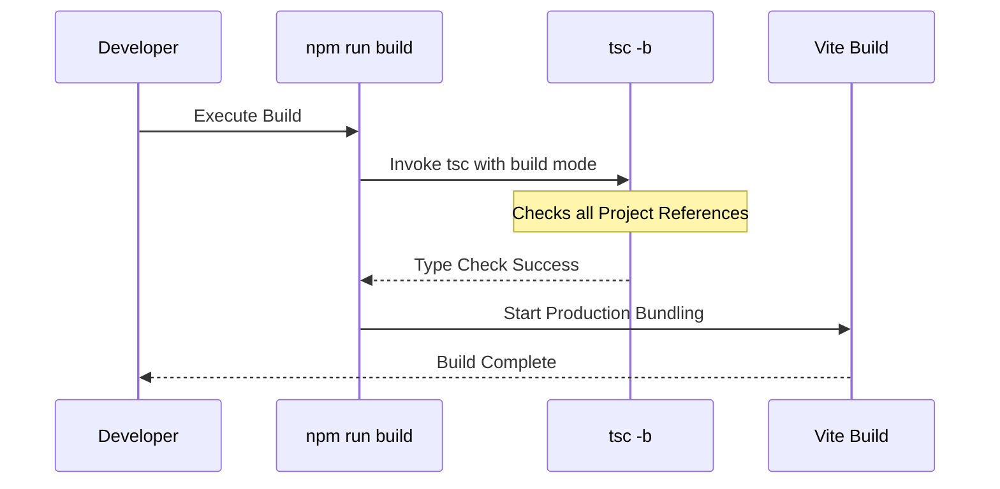
```mermaid
sequenceDiagram
    participant Dev as Developer
    participant Script as npm run build
    participant TSC as tsc -b
    participant Vite as Vite Build

    Dev->>Script: Execute Build
    Script->>TSC: Invoke tsc with build mode
    Note over TSC: Checks all Project References
    TSC-->>Script: Type Check Success
    Script->>Vite: Start Production Bundling
    Vite-->>Dev: Build Complete
```
The build process ensures type safety before bundling begins.
Sources: [package.json:7](), [AGENTS.md:14-16]()

### Linting and Type Safety
The project uses `typescript-eslint` to enforce coding standards. The `eslint.config.js` file extends the recommended TypeScript rules and identifies files ending in `.ts` and `.tsx` for analysis.
Sources: [eslint.config.js:10-15](), [package.json:35]()

## Project Strictness and Guidelines
As per the project's technical documentation, the following TypeScript constraints are enforced:
*   **Strict Mode**: Enabled by default in `tsconfig.app.json`.
*   **No Implicit Any**: Part of the strict suite, requiring explicit types.
*   **Interfaces over Types**: Preferred for object shapes.
*   **Union Types**: Used for constrained values (e.g., car categories).
*   **Explicit Ref Typing**: React refs must be typed, such as `useRef<HTMLElement>(null)`.

Sources: [tsconfig.app.json:23](), [AGENTS.md:59-71](), [AGENTS.md:80-82]()

## Summary
The TypeScript configuration in Wasalny Landing Page is a structured implementation of modern best practices. By utilizing Project References (`tsconfig.app.json` and `tsconfig.node.json`), it ensures that the application code and the build tooling are treated with appropriate, context-specific settings while maintaining a unified type-checking process during the build phase.


## Core Features: Pricing Calculator

### Pricing Calculator Overview

<details>
<summary>Relevant source files</summary>

The following files were used as context for generating this wiki page:

- [src/components/sections/PricingCalculator.tsx](https://github.com/MostafaElzoghbey/wasalny-landing-page/blob/main/src/components/sections/PricingCalculator.tsx)
- [src/hooks/usePricingCalculator.ts](https://github.com/MostafaElzoghbey/wasalny-landing-page/blob/main/src/hooks/usePricingCalculator.ts)
- [src/utils/pricingCalculator.ts](https://github.com/MostafaElzoghbey/wasalny-landing-page/blob/main/src/utils/pricingCalculator.ts)
- [src/components/ui/PriceBreakdown.tsx](https://github.com/MostafaElzoghbey/wasalny-landing-page/blob/main/src/components/ui/PriceBreakdown.tsx)
- [src/data/content.ts](https://github.com/MostafaElzoghbey/wasalny-landing-page/blob/main/src/data/content.ts)
- [AGENTS.md](https://github.com/MostafaElzoghbey/wasalny-landing-page/blob/main/AGENTS.md)
</details>

# Pricing Calculator Overview

## Introduction

The Pricing Calculator is a core feature of the Wasalny landing page, designed to provide users with accurate fare estimates for transportation services in Damietta, Egypt. It allows users to select route types (travel or internal), specify departure and destination points, choose vehicle categories, and define passenger counts and schedules. The system calculates a final price based on predefined data models and offers a seamless transition to a booking confirmation via WhatsApp.

Sources: [src/components/sections/PricingCalculator.tsx:18-25](), [AGENTS.md:5-7](), [src/hooks/usePricingCalculator.ts:10-25]()

## Architecture and Data Flow

The pricing system follows a modular architecture consisting of a React functional component for the UI, a custom hook for state management, and utility functions for heavy logic.

### Component Structure
The UI is built using several specialized sub-components organized within a grid layout. The `PricingCalculator` section acts as a container that integrates with the `usePricingCalculator` hook to provide data to child components like `RouteSelectionCard`, `VehiclePassengerCard`, and `DateTimeCard`.

Sources: [src/components/sections/PricingCalculator.tsx:12-16](), [src/components/sections/PricingCalculator.tsx:55-103]()

### Logic and State Management
The `usePricingCalculator` hook manages the complex state of the form, including derived state for available locations and trip calculations. It implements persistence using `localStorage` to retain user selections across sessions.

Sources: [src/hooks/usePricingCalculator.ts:11-30](), [src/hooks/usePricingCalculator.ts:115-128]()

### Calculation Workflow
The following diagram illustrates the flow of data from user input to the final price breakdown and WhatsApp integration:

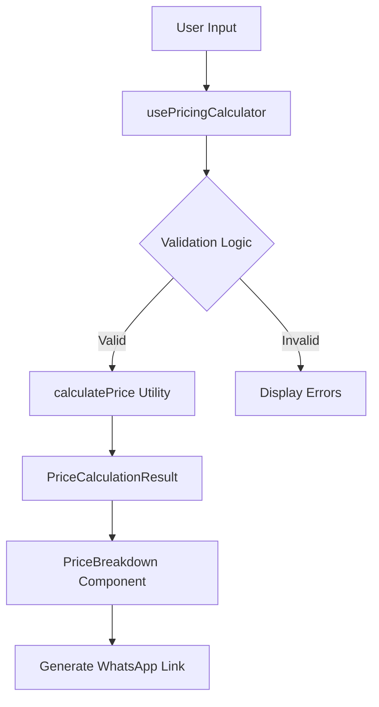
```mermaid
flowchart TD
    User[User Input] --> Hook[usePricingCalculator]
    Hook --> Validation{Validation Logic}
    Validation -- Valid --> Calc[calculatePrice Utility]
    Validation -- Invalid --> Errors[Display Errors]
    Calc --> Result[PriceCalculationResult]
    Result --> UI[PriceBreakdown Component]
    UI --> WA[Generate WhatsApp Link]
```
Sources: [src/hooks/usePricingCalculator.ts:70-100](), [src/utils/pricingCalculator.ts:37-45]()

## Data Structures and Models

The system relies on strongly typed interfaces to ensure consistency across the calculation and display layers.

### Trip and Result Interfaces
| Interface | Description | Key Fields |
| :--- | :--- | :--- |
| `TripDetails` | Input data for calculation | `fromLocation`, `toLocation`, `vehicleCategory`, `passengerCount`, `isRoundTrip` |
| `PriceBreakdown` | Itemized price info | `vehicleType`, `basePrice`, `total` |
| `PriceCalculationResult` | Final calculation output | `breakdown`, `details`, `warnings` |

Sources: [src/utils/pricingCalculator.ts:11-35]()

### Route and Vehicle Configuration
The system categorizes routes into `travel` (external) and `internal` (within Damietta). Vehicle categories include options like `sedan`, `suv`, and `family_cruiser`.

Sources: [src/hooks/usePricingCalculator.ts:11-15](), [AGENTS.md:73-75]()

## Calculation Logic and Utilities

The calculation logic is isolated in `src/utils/pricingCalculator.ts` to maintain a clean separation of concerns.

### Core Calculation Function
The `calculatePrice` function performs the following steps:
1.  **Route Matching**: Finds the `routeGroup` based on the selected IDs.
2.  **Vehicle Validation**: Retrieves pricing for the specific vehicle category.
3.  **Passenger Checks**: Validates if the passenger count is within the minimum and maximum allowed for the vehicle.
4.  **Price Retrieval**: Fetches the fixed price based on `oneWay` or `roundTrip` status.

Sources: [src/utils/pricingCalculator.ts:37-70]()

### WhatsApp Integration
After calculation, the system generates a pre-filled Arabic message for the user to send to the service provider.

```typescript
// Example of the message generation logic
export function generateWhatsAppMessage(result: PriceCalculationResult): string {
  const { details } = result;
  let message = 'السلام عليكم\n\nأريد حجز رحلة مع وصلني\n\n';
  message += `المسار: ${details.routeNameAr}\n`;
  message += `نوع السيارة: ${details.vehicleCategoryAr}\n`;
  return encodeURIComponent(message);
}
```
Sources: [src/utils/pricingCalculator.ts:100-112]()

## UI Components

### PriceBreakdown
The `PriceBreakdown.tsx` component serves as the summary view. It displays the itemized list (Vehicle Type, Passenger Count, Trip Type) and the final total. It also conditionally renders warnings if the passenger count exceeds vehicle capacity.

Sources: [src/components/ui/PriceBreakdown.tsx:32-60]()

### Form Controls
The form utilizes a mix of buttons and cards:
-   **Route Toggle**: Switches between "Travel" and "Internal Damietta" modes.
-   **Smart Vehicle Switch**: A feature in the hook that automatically updates the vehicle category if the passenger count exceeds the current vehicle's limit.

Sources: [src/components/sections/PricingCalculator.tsx:43-65](), [src/hooks/usePricingCalculator.ts:145-155]()

## Persistence and Validation

| Feature | Implementation | Source |
| :--- | :--- | :--- |
| **Persistence** | `localStorage` key `wasalny_pricing_v2` | [src/hooks/usePricingCalculator.ts:127]() |
| **Input Validation** | `useMemo` based errors array | [src/hooks/usePricingCalculator.ts:93-109]() |
| **Route Detection** | Auto-detects `routeType` based on location IDs | [src/hooks/usePricingCalculator.ts:61-68]() |

## Conclusion

The Pricing Calculator is a sophisticated integration of React state management and static data utilities. By decoupling the calculation logic from the UI components and using a custom hook for state synchronization, the system provides a responsive and reliable user experience. The inclusion of `localStorage` persistence and automatic vehicle adjustment ensures high usability for potential customers.

Sources: [src/App.tsx:38](), [src/hooks/usePricingCalculator.ts:145-160]()

### Route & Date Selection

<details>
<summary>Relevant source files</summary>

The following files were used as context for generating this wiki page:

- [src/hooks/usePricingCalculator.ts](https://github.com/MostafaElzoghbey/wasalny-landing-page/blob/main/src/hooks/usePricingCalculator.ts)
- [src/utils/pricingCalculator.ts](https://github.com/MostafaElzoghbey/wasalny-landing-page/blob/main/src/utils/pricingCalculator.ts)
- [src/components/sections/PricingCalculator.tsx](https://github.com/MostafaElzoghbey/wasalny-landing-page/blob/main/src/components/sections/PricingCalculator.tsx)
- [src/components/sections/RoutesSection.tsx](https://github.com/MostafaElzoghbey/wasalny-landing-page/blob/main/src/components/sections/RoutesSection.tsx)
- [src/data/content.ts](https://github.com/MostafaElzoghbey/wasalny-landing-page/blob/main/src/data/content.ts)
</details>

# Route & Date Selection

## Introduction
The Route & Date Selection system is a core functional module of the Wasalny landing page, responsible for capturing user trip preferences to calculate transportation costs. It allows users to define their starting point and destination, choose between travel or internal Damietta routes, and specify the schedule for their journey.

This system serves as the primary input layer for the [Pricing Calculator](#pricing-calculator-logic), facilitating a seamless flow from route discovery to booking via WhatsApp. It integrates dynamic location filtering based on route types and provides real-time validation for user selections.

Sources: [src/components/sections/PricingCalculator.tsx](), [src/hooks/usePricingCalculator.ts]()

## Route Management Architecture
The system categorizes journeys into two primary types: "Travel" (long-distance) and "Internal" (within Damietta). This classification dictates the available locations and specific features like round-trip toggles.

### Route Classification and Selection
Users select a `RouteType` which filters the available "From" and "To" locations. The system uses a detection logic to automatically switch the route type if the selected locations imply a specific category.

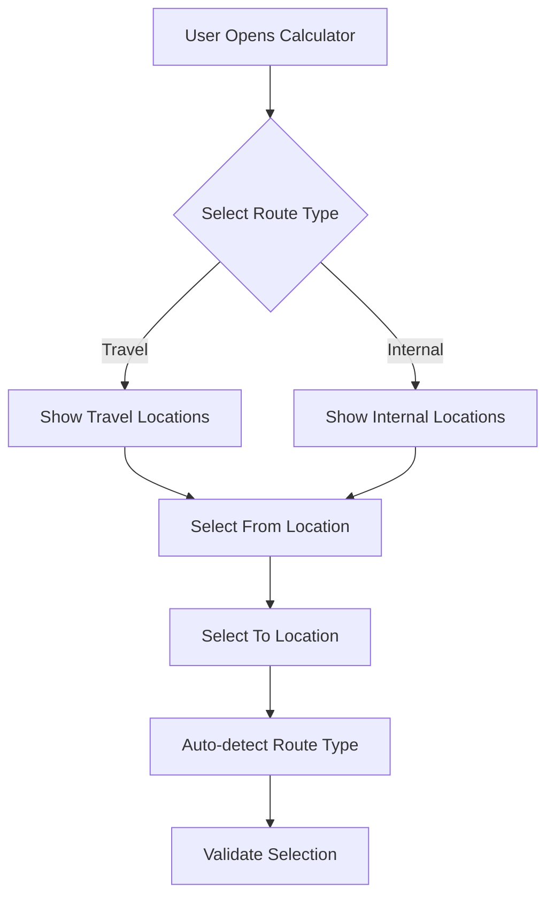
```mermaid
flowchart TD
    Start[User Opens Calculator] --> SelectType{Select Route Type}
    SelectType -- Travel --> TLocs[Show Travel Locations]
    SelectType -- Internal --> ILocs[Show Internal Locations]
    TLocs --> PickFrom[Select From Location]
    ILocs --> PickFrom
    PickFrom --> PickTo[Select To Location]
    PickTo --> AutoDetect[Auto-detect Route Type]
    AutoDetect --> Validation[Validate Selection]
```
The logic ensures that "To" locations are dependent on the chosen "From" location to prevent invalid route combinations.
Sources: [src/hooks/usePricingCalculator.ts:36-54](), [src/utils/pricingCalculator.ts:108]()

### Key Data Structures
| Field | Type | Description |
| :--- | :--- | :--- |
| `routeType` | `RouteType` | 'travel' or 'internal' categories. |
| `fromLocation` | `string` | ID of the starting point. |
| `toLocation` | `string` | ID of the destination. |
| `isRoundTrip` | `boolean` | Toggle for return journeys (Travel only). |

Sources: [src/hooks/usePricingCalculator.ts:13-26](), [src/utils/pricingCalculator.ts:10-18]()

## Scheduling and Temporal Logic
The scheduling module manages the `tripDate` and `tripTime` inputs. By default, the system initializes the trip date to the following day to encourage advance booking.

### Date and Time Handling
The `usePricingCalculator` hook maintains the state for dates as ISO strings to ensure compatibility with standard HTML input elements, while converting them to `Date` objects for calculation logic.

*   **Default State:** Initializes to tomorrow's date using `tomorrow.toISOString().split('T')[0]`.
*   **Time Selection:** Defaulted to `10:00`.
*   **DateTime Construction:** Combines date and time strings into a single `Date` object during the price calculation phase.

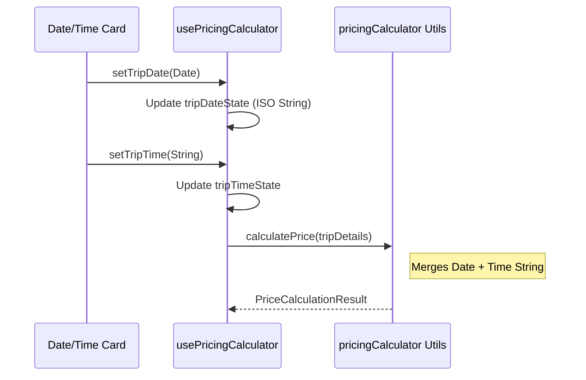
```mermaid
sequenceDiagram
    participant UI as Date/Time Card
    participant Hook as usePricingCalculator
    participant Calc as pricingCalculator Utils
    
    UI->>Hook: setTripDate(Date)
    Hook->>Hook: Update tripDateState (ISO String)
    UI->>Hook: setTripTime(String)
    Hook->>Hook: Update tripTimeState
    Hook->>Calc: calculatePrice(tripDetails)
    Note right of Calc: Merges Date + Time String
    Calc-->>Hook: PriceCalculationResult
```
Sources: [src/hooks/usePricingCalculator.ts:20-25](), [src/utils/pricingCalculator.ts:58-62]()

## Data Flow and Persistence
The system employs React's `useEffect` and `useMemo` hooks to synchronize state and provide persistent user experiences.

### State Synchronization
1.  **Type Reset:** When a user changes the `routeType`, the `fromLocation`, `toLocation`, and `isRoundTrip` states are reset to prevent cross-type data corruption.
2.  **Validation:** `availableToLocations` are recalculated whenever the `fromLocation` changes. If the current `toLocation` is no longer valid for the new origin, it is cleared.
3.  **Local Storage:** The `routeType`, `vehicleCategory`, and `passengerCount` are persisted in `localStorage` under the key `wasalny_pricing_v2`.

Sources: [src/hooks/usePricingCalculator.ts:38-47](), [src/hooks/usePricingCalculator.ts:105-121]()

## User Interface Components
The route and date selection is implemented across several specialized UI components within the `PricingCalculator` section.

### Component Breakdown
*   **RouteSelectionCard:** Handles the geographic inputs (`from` and `to` locations).
*   **DateTimeCard:** Manages the `tripDate`, `tripTime`, and `isRoundTrip` toggle. It conditionally hides the round-trip option for internal routes.
*   **PricingCalculator Section:** Acts as the layout container, using `useBatchReveal` for entrance animations and managing the high-level `routeType` toggle (Travel vs. Internal).

Sources: [src/components/sections/PricingCalculator.tsx:12-88]()

## Conclusion
The Route & Date Selection system provides the foundational parameters required for Wasalny's pricing engine. By combining rigid data structures for locations with flexible scheduling and persistent state management, it ensures that users can accurately define their travel needs before proceeding to the final price breakdown and booking.

Sources: [src/hooks/usePricingCalculator.ts](), [src/utils/pricingCalculator.ts]()

### Vehicle & Passenger Configuration

<details>
<summary>Relevant source files</summary>

The following files were used as context for generating this wiki page:

- [src/components/pricing/VehiclePassengerCard.tsx](https://github.com/MostafaElzoghbey/wasalny-landing-page/blob/main/src/components/pricing/VehiclePassengerCard.tsx)
- [src/data/pricing.ts](https://github.com/MostafaElzoghbey/wasalny-landing-page/blob/main/src/data/pricing.ts)
- [src/hooks/usePricingCalculator.ts](https://github.com/MostafaElzoghbey/wasalny-landing-page/blob/main/src/hooks/usePricingCalculator.ts)
- [src/utils/pricingCalculator.ts](https://github.com/MostafaElzoghbey/wasalny-landing-page/blob/main/src/utils/pricingCalculator.ts)
- [src/types/index.ts](https://github.com/MostafaElzoghbey/wasalny-landing-page/blob/main/src/types/index.ts)
- [src/components/sections/PricingCalculator.tsx](https://github.com/MostafaElzoghbey/wasalny-landing-page/blob/main/src/components/sections/PricingCalculator.tsx)
</details>

# Vehicle & Passenger Configuration

## Introduction
The Vehicle & Passenger Configuration module is a core component of the Wasalny landing page's pricing system. It manages the selection of vehicle types and the number of passengers for a requested trip, ensuring that user selections remain within the physical constraints of the fleet. This configuration directly influences the final price calculation and the validation logic required before a booking can be finalized via WhatsApp.

The system is designed to be reactive, automatically suggesting or switching vehicle categories based on the passenger count to optimize the user experience. It serves as a bridge between the static fleet data and the dynamic pricing engine.

Sources: [src/hooks/usePricingCalculator.ts](), [src/components/sections/PricingCalculator.tsx]()

## Data Models and Fleet Specifications
The configuration is grounded in a structured data model that defines the capabilities of the available fleet. Each vehicle category is associated with specific passenger limits and localized naming.

### Vehicle Categories
The system supports four distinct vehicle categories:
*   **Sedan (سيدان):** Standard transport for small groups.
*   **SUV (دفع رباعي):** Enhanced comfort and luggage space.
*   **Family Cruiser (عائلية):** High-capacity vehicle for medium groups.
*   **Minibus (ميني باص):** Large-scale transport for groups up to 13.

Sources: [src/data/pricing.ts:145-171](), [src/types/index.ts:1-11]()

### Fleet Constraints Table
The following table outlines the technical constraints defined in the pricing data:

| Category | Arabic Name | Min Passengers | Max Passengers |
| :--- | :--- | :--- | :--- |
| `sedan` | سيدان | 1 | 3 |
| `suv` | دفع رباعي | 1 | 4 |
| `family_cruiser` | عائلية | 1 | 7 |
| `minibus` | ميني باص | 1 | 13 |

Sources: [src/data/pricing.ts:145-171]()

## Selection Logic and State Management
The state of the vehicle and passenger configuration is managed primarily by the `usePricingCalculator` hook. This hook handles the synchronization between the user's input and the allowed constraints.

### Smart Vehicle Switching
A key feature of the configuration logic is the "Smart Vehicle Switch." When a user increases the passenger count beyond the capacity of the currently selected vehicle, the system automatically iterates through the `vehiclePricing` data to find and select the first vehicle category that can accommodate the new count.

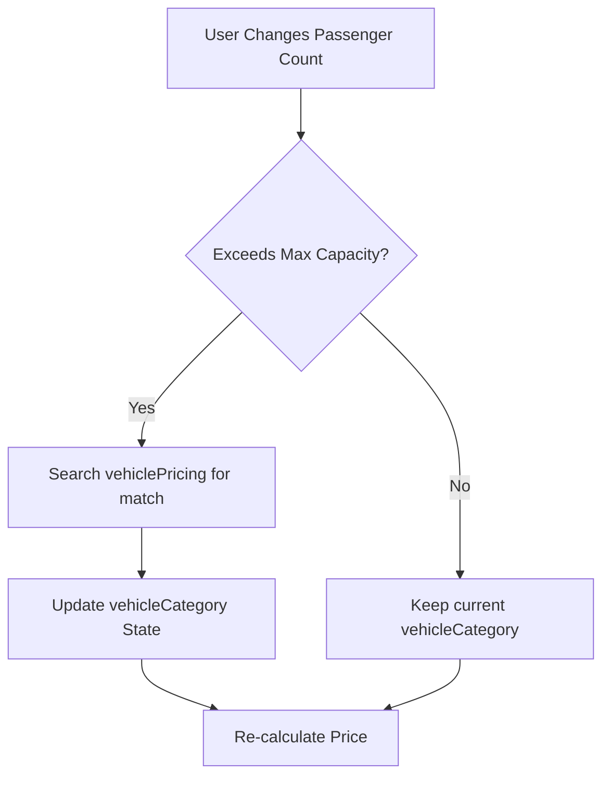
```mermaid
flowchart TD
    A[User Changes Passenger Count] --> B{Exceeds Max Capacity?}
    B -- Yes --> C[Search vehiclePricing for match]
    C --> D[Update vehicleCategory State]
    B -- No --> E[Keep current vehicleCategory]
    D --> F[Re-calculate Price]
    E --> F
```
Sources: [src/hooks/usePricingCalculator.ts:146-156]()

### Validation Engine
The system performs real-time validation to prevent invalid booking requests. If the `passengerCount` exceeds the `maxPassengers` defined for the selected `vehicleCategory`, a validation error is generated and displayed to the user.

Sources: [src/hooks/usePricingCalculator.ts:88-103]()

## Component Architecture
The user interface for this module is encapsulated in the `VehiclePassengerCard` component, which is integrated into the larger `PricingCalculator` section.

### Data Flow Sequence
The following diagram illustrates how the configuration state flows from the user interface through the hooks to the final pricing result.

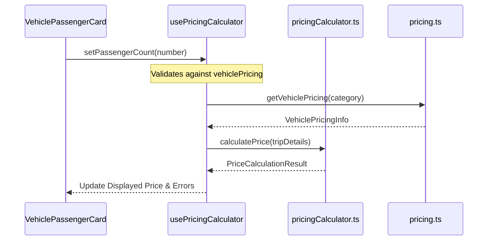
```mermaid
sequenceDiagram
    participant UI as VehiclePassengerCard
    participant Hook as usePricingCalculator
    participant Util as pricingCalculator.ts
    participant Data as pricing.ts

    UI->>Hook: setPassengerCount(number)
    Note over Hook: Validates against vehiclePricing
    Hook->>Data: getVehiclePricing(category)
    Data-->>Hook: VehiclePricingInfo
    Hook->>Util: calculatePrice(tripDetails)
    Util-->>Hook: PriceCalculationResult
    Hook-->>UI: Update Displayed Price & Errors
```
Sources: [src/hooks/usePricingCalculator.ts:60-85](), [src/utils/pricingCalculator.ts:40-90]()

## Implementation Details

### Price Calculation Impact
The selected vehicle and passenger count are critical inputs for the `calculatePrice` function. The pricing engine uses the `vehicleCategory` as a key to look up fixed rates within a `RouteGroup`.

| Data Element | Usage in Pricing |
| :--- | :--- |
| `vehicleCategory` | Selects the price tier (e.g., `pricing.sedan.oneWay`) |
| `passengerCount` | Used for validation and included in the WhatsApp booking summary |
| `isRoundTrip` | Determines whether to use the `oneWay` or `roundTrip` rate for the selected vehicle |

Sources: [src/utils/pricingCalculator.ts:55-75](), [src/data/pricing.ts:25-35]()

### Persistence
The configuration state (category and count) is persisted in `localStorage` under the key `wasalny_pricing_v2`. This ensures that user selections remain intact even after page refreshes.

Sources: [src/hooks/usePricingCalculator.ts:114-135]()

## Conclusion
The Vehicle & Passenger Configuration system provides a robust framework for managing trip requirements. By combining strict data-driven constraints with "smart" UI logic, the system ensures that every booking request generated is technically feasible according to the Wasalny fleet specifications, while maintaining a seamless experience for the end-user.

### Price Estimation Engine

<details>
<summary>Relevant source files</summary>

The following files were used as context for generating this wiki page:

- [src/utils/pricingCalculator.ts](https://github.com/MostafaElzoghbey/wasalny-landing-page/blob/main/src/utils/pricingCalculator.ts)
- [src/components/ui/PriceBreakdown.tsx](https://github.com/MostafaElzoghbey/wasalny-landing-page/blob/main/src/components/ui/PriceBreakdown.tsx)
- [src/hooks/usePricingCalculator.ts](https://github.com/MostafaElzoghbey/wasalny-landing-page/blob/main/src/hooks/usePricingCalculator.ts)
- [src/components/sections/PricingCalculator.tsx](https://github.com/MostafaElzoghbey/wasalny-landing-page/blob/main/src/components/sections/PricingCalculator.tsx)
- [src/data/content.ts](https://github.com/MostafaElzoghbey/wasalny-landing-page/blob/main/src/data/content.ts)
</details>

# Price Estimation Engine

The Price Estimation Engine is a core module within the Wasalny landing page responsible for calculating trip costs based on user-defined parameters. It facilitates a seamless booking experience by providing real-time price breakdowns for various transportation services, including travel routes (e.g., Damietta to Cairo/Airports) and internal Damietta routes.

The engine operates by processing trip details—such as origin, destination, vehicle category, and trip type (one-way or round-trip)—against a predefined pricing dataset. The resulting calculations are then formatted for display and used to generate pre-filled WhatsApp messages for booking confirmation.

Sources: [src/utils/pricingCalculator.ts:1-10](), [src/hooks/usePricingCalculator.ts:15-25]()

## Core Architecture and Data Flow

The engine is built on a modular architecture that separates state management, calculation logic, and UI representation. The data flow follows a unidirectional pattern: user inputs are captured via React state, processed through a custom hook, calculated by utility functions, and finally rendered in the UI.

### Logic Flow Diagram
The following diagram illustrates the lifecycle of a price estimation request, from user input to the generation of a WhatsApp booking link.

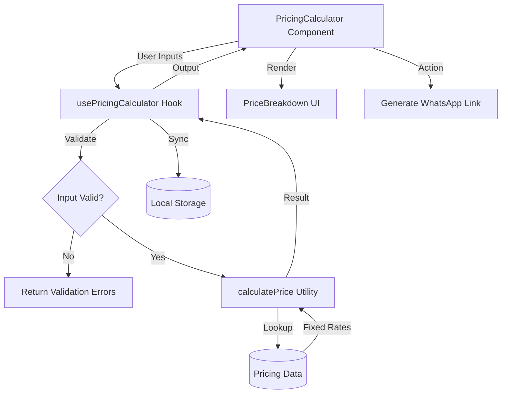
```mermaid
flowchart TD
    UI[PricingCalculator Component] -->|User Inputs| Hook[usePricingCalculator Hook]
    Hook -->|Validate| Validate{Input Valid?}
    Validate -->|No| Errors[Return Validation Errors]
    Validate -->|Yes| Calc[calculatePrice Utility]
    Calc -->|Lookup| Data[(Pricing Data)]
    Data -->|Fixed Rates| Calc
    Calc -->|Result| Hook
    Hook -->|Sync| Storage[(Local Storage)]
    Hook -->|Output| UI
    UI -->|Render| Breakdown[PriceBreakdown UI]
    UI -->|Action| WhatsApp[Generate WhatsApp Link]
```
Sources: [src/hooks/usePricingCalculator.ts:80-130](), [src/components/sections/PricingCalculator.tsx:20-50]()

## State Management and Hooks

The `usePricingCalculator` hook serves as the primary controller for the engine. It manages the complex state of the pricing form, including route types (`travel` vs `internal`), location selections, and passenger counts.

### Key Hook Responsibilities
*   **Location Filtering:** Dynamically updates available "To" locations based on the selected "From" location and route type.
*   **Automatic Detection:** Uses `detectRouteType` to automatically switch between travel and internal modes based on selection.
*   **State Persistence:** Synchronizes user selections with `localStorage` to preserve progress across sessions.
*   **Smart Vehicle Switching:** Automatically suggests or switches to a suitable vehicle category if the passenger count exceeds the current vehicle's capacity.

Sources: [src/hooks/usePricingCalculator.ts:33-75](), [src/hooks/usePricingCalculator.ts:145-165]()

## Pricing Logic and Calculation

The calculation logic is encapsulated in the `calculatePrice` function. Unlike dynamic distance-based pricing, this engine utilizes a fixed-rate model based on route groups and vehicle categories.

### Calculation Parameters
| Parameter | Type | Description |
| :--- | :--- | :--- |
| `fromLocation` | `string` | The ID of the starting location. |
| `toLocation` | `string` | The ID of the destination. |
| `vehicleCategory` | `VehicleCategory` | The selected vehicle (e.g., sedan, suv, minibus). |
| `passengerCount` | `number` | Total number of passengers for capacity validation. |
| `isRoundTrip` | `boolean` | Flag to determine if a round-trip rate applies. |

Sources: [src/utils/pricingCalculator.ts:12-20](), [src/utils/pricingCalculator.ts:37-55]()

### Implementation Detail: Fixed Rate Calculation
The engine retrieves a `routeGroup` based on the origin and destination. It then accesses the specific price for the selected vehicle and trip type.

```typescript
// src/utils/pricingCalculator.ts:70-73
const tripType = isRoundTrip ? 'roundTrip' : 'oneWay';
const basePrice = routeGroup.pricing[vehicleCategory][tripType];
const total = basePrice; // Final total for the selected route
```

## UI Components and Integration

The estimation engine is integrated into the frontend through two primary components: the `PricingCalculator` section and the `PriceBreakdown` card.

### PricingCalculator Section
This component acts as the layout container. It organizes the input fields into logical groups:
1.  **Route Type Toggle:** Switches between 'Travel' and 'Internal' modes.
2.  **RouteSelectionCard:** Handles location dropdowns.
3.  **VehiclePassengerCard:** Manages vehicle types and passenger limits.
4.  **DateTimeCard:** Captures scheduling information and round-trip toggles.

Sources: [src/components/sections/PricingCalculator.tsx:40-100]()

### PriceBreakdown Component
The `PriceBreakdown` component provides a detailed view of the calculation result. It displays the base price, vehicle type, and passenger count. Crucially, it renders any calculation warnings (e.g., capacity issues) and the final CTA button.

Sources: [src/components/ui/PriceBreakdown.tsx:35-60]()

## Booking Integration

The final output of the engine is a formatted WhatsApp message. This is generated by the `generateWhatsAppMessage` function, which compiles the trip details into a human-readable Arabic text.

### Booking Workflow Sequence
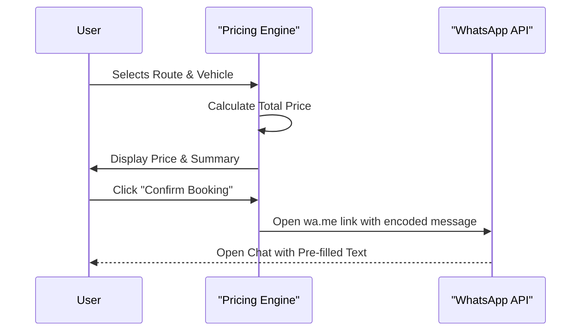
```mermaid
sequenceDiagram
    participant User
    participant App as "Pricing Engine"
    participant WA as "WhatsApp API"
    
    User->>App: Selects Route & Vehicle
    App->>App: Calculate Total Price
    App->>User: Display Price & Summary
    User->>App: Click "Confirm Booking"
    App->>WA: Open wa.me link with encoded message
    WA-->>User: Open Chat with Pre-filled Text
```
Sources: [src/utils/pricingCalculator.ts:98-125](), [src/components/ui/PriceBreakdown.tsx:100-115]()

## Conclusion

The Price Estimation Engine provides a robust and user-friendly interface for calculating travel costs. By leveraging a centralized pricing utility and a reactive state hook, it ensures that users receive accurate, real-time feedback on their trip planning. Its integration with WhatsApp serves as the primary conversion point for the Wasalny service, bridging the gap between automated estimation and manual booking confirmation.

### Pricing & Fleet Data Models

<details>
<summary>Relevant source files</summary>

The following files were used as context for generating this wiki page:

- [src/data/pricing.ts](https://github.com/MostafaElzoghbey/wasalny-landing-page/blob/main/src/data/pricing.ts)
- [src/data/cars.ts](https://github.com/MostafaElzoghbey/wasalny-landing-page/blob/main/src/data/cars.ts)
- [src/utils/pricingCalculator.ts](https://github.com/MostafaElzoghbey/wasalny-landing-page/blob/main/src/utils/pricingCalculator.ts)
- [src/hooks/usePricingCalculator.ts](https://github.com/MostafaElzoghbey/wasalny-landing-page/blob/main/src/hooks/usePricingCalculator.ts)
- [src/components/sections/FleetSection.tsx](https://github.com/MostafaElzoghbey/wasalny-landing-page/blob/main/src/components/sections/FleetSection.tsx)
</details>

# Pricing & Fleet Data Models

## Introduction

The **Pricing & Fleet Data Models** system serves as the core data layer for the Wasalny landing page, managing the relationships between geographic locations, transportation routes, and vehicle specifications. It provides a structured framework for calculating trip costs based on vehicle categories (Sedan, SUV, Family Cruiser, Minibus) and route types (Travel or Internal Damietta).

This system enables the dynamic pricing engine to resolve complex routing logic, such as bidirectional travel and multi-location grouping, while ensuring that passenger capacity constraints are strictly enforced. The data models defined here are consumed by React hooks and utility functions to provide users with instant, accurate quotes and an interactive fleet showcase.

Sources: [src/data/pricing.ts:1-5](), [src/utils/pricingCalculator.ts:31-40]()

## Data Models & Core Structures

The architecture relies on several TypeScript interfaces that define the shape of the transportation network and the fleet attributes.

### 1. Location and Route Groups
Locations are classified by `RouteType`, distinguishing between long-distance travel (e.g., Cairo Airport) and local movement within Damietta. The `RouteGroup` interface is the pivot point for pricing, linking sets of "From" and "To" locations to specific price points.

```mermaid
classDiagram
    class Location {
        +String id
        +String name
        +String nameAr
        +RouteType type
    }
    class RouteGroup {
        +String id
        +RouteType type
        +String[] fromLocations
        +String[] toLocations
        +String nameAr
        +Boolean bidirectional
        +Pricing pricing
    }
    class Pricing {
        +VehiclePrice sedan
        +VehiclePrice suv
        +VehiclePrice family_cruiser
        +VehiclePrice minibus
    }
    class VehiclePrice {
        +Number oneWay
        +Number roundTrip
    }
    Location --> RouteGroup : belongs to
    RouteGroup *-- Pricing : defines
```
Sources: [src/data/pricing.ts:4-29]()

### 2. Vehicle Specifications
The fleet is categorized into four primary tiers. Each tier defines its physical capacity and localization strings used across the UI.

| Field | Type | Description |
| :--- | :--- | :--- |
| `category` | `VehicleCategory` | Unique identifier (`sedan`, `suv`, `family_cruiser`, `minibus`) |
| `categoryAr` | `string` | Arabic localized name for the vehicle tier |
| `maxPassengers` | `number` | Maximum occupancy limit |
| `minPassengers` | `number` | Minimum required passengers (usually 1) |

Sources: [src/data/pricing.ts:31-36](), [src/components/sections/FleetSection.tsx:18-47]()

## Pricing Engine Logic

The calculation logic is encapsulated within `calculatePrice`, which utilizes a set of utility functions to find the appropriate pricing bracket based on the user's trip details.

### Calculation Flow
The engine follows a strict sequence to resolve the final cost:
1. **Route Resolution**: Checks if the selected "From" and "To" IDs exist within a `RouteGroup`.
2. **Vehicle Validation**: Verifies the selected category against `vehiclePricing` data.
3. **Capacity Check**: Compares `passengerCount` against the vehicle's `maxPassengers`.
4. **Price Retrieval**: Accesses the nested pricing object using the `tripType` (oneWay/roundTrip) as a key.

```mermaid
flowchart TD
    Start[Input: TripDetails] --> FindGroup[Find RouteGroup]
    FindGroup -->|Not Found| Error[Throw Route Error]
    FindGroup -->|Found| GetVehicle[Get Vehicle Pricing Info]
    GetVehicle --> CheckCap[Validate Passenger Count]
    CheckCap -->|Exceeds| AddWarning[Add Warning Message]
    CheckCap -->|Valid| ResolvePrice[Get Price: oneWay vs roundTrip]
    AddWarning --> ResolvePrice
    ResolvePrice --> BuildResult[Return PriceCalculationResult]
```
Sources: [src/utils/pricingCalculator.ts:31-70](), [src/data/pricing.ts:161-175]()

## State Management via Hooks

The `usePricingCalculator` hook manages the interactive state of the pricing form. It handles derived state, such as filtering valid "To" locations based on the selected "From" location.

### Hook Derived State Logic
| Derived Value | Source Logic |
| :--- | :--- |
| `availableToLocations` | Filters `locations` based on `routeGroups` where the current `fromLocation` is a valid starting point. |
| `whatsappLink` | Formats a `PriceCalculationResult` into an encoded string for the WhatsApp API. |
| `isValid` | Boolean check ensuring both locations are selected and no validation errors exist. |

Sources: [src/hooks/usePricingCalculator.ts:38-48](), [src/hooks/usePricingCalculator.ts:117-121]()

### Persistence and Sync
The hook implements `useEffect` to persist user selections (Route Type, Category, Passenger Count) to `localStorage`, ensuring a seamless experience across page reloads. It also includes a "Smart Vehicle Switch" that automatically updates the `vehicleCategory` if the passenger count exceeds the current vehicle's capacity.

Sources: [src/hooks/usePricingCalculator.ts:98-115](), [src/hooks/usePricingCalculator.ts:126-135]()

## Fleet Presentation Data

The `FleetSection` component utilizes the `carImages` and `carCategories` datasets to render a 3D-perspective carousel. 

### Data Relationships
- **Images**: Indexed by `VehicleCategory`, containing arrays of high-quality assets.
- **Categorization**: Links technical IDs to UI-friendly Arabic labels and icons (e.g., `Car`, `Bus`, `UsersRound`).
- **Feature Sets**: Hardcoded metadata in the component (e.g., "Air Conditioning", "USB Charger") mapped to each category.

Sources: [src/components/sections/FleetSection.tsx:18-47](), [src/data/cars.ts]() (referenced)

## Conclusion

The Pricing & Fleet Data Models provide a robust, type-safe foundation for the Wasalny platform. By decoupling geographic routing from vehicle-specific pricing, the system allows for easy scaling of the transportation network while maintaining strict validation of passenger capacity and trip logistics. This architecture ensures that the data flow—from raw static definitions to complex UI state—remains predictable and technically accurate.


## Frontend Components & UI

### Atomic UI Components

<details>
<summary>Relevant source files</summary>

The following files were used as context for generating this wiki page:

- [src/components/ui/Button.tsx](https://github.com/MostafaElzoghbey/wasalny-landing-page/blob/main/src/components/ui/Button.tsx)
- [src/components/ui/SectionHeading.tsx](https://github.com/MostafaElzoghbey/wasalny-landing-page/blob/main/src/components/ui/SectionHeading.tsx)
- [src/components/ui/ThemeToggle.tsx](https://github.com/MostafaElzoghbey/wasalny-landing-page/blob/main/src/components/ui/ThemeToggle.tsx)
- [src/components/ui/CustomSelect.tsx](https://github.com/MostafaElzoghbey/wasalny-landing-page/blob/main/src/components/ui/CustomSelect.tsx)
- [src/components/ui/PageLoader.tsx](https://github.com/MostafaElzoghbey/wasalny-landing-page/blob/main/src/components/ui/PageLoader.tsx)
- [src/components/ui/FloatingCTA.tsx](https://github.com/MostafaElzoghbey/wasalny-landing-page/blob/main/src/components/ui/FloatingCTA.tsx)
- [src/index.css](https://github.com/MostafaElzoghbey/wasalny-landing-page/blob/main/src/index.css)
- [AGENTS.md](https://github.com/MostafaElzoghbey/wasalny-landing-page/blob/main/AGENTS.md)
</details>

# Atomic UI Components

Atomic UI Components in the Wasalny project represent the foundational, reusable building blocks used to construct the landing page's user interface. These components are designed with strict TypeScript interfaces, leveraging Tailwind CSS v4 for styling and GSAP (GreenSock Animation Platform) for high-performance interactive animations. They are located within the `src/components/ui/` directory and follow a functional component pattern.

The architecture emphasizes separation of concerns, where component logic handles state and accessibility, while external libraries like GSAP manage complex motion sequences and scroll-triggered reveals.

Sources: [AGENTS.md:15-28](), [src/index.css:1-20]()

## Core UI Components

### Button Component
The `Button` component is a highly versatile interactive element supporting multiple visual variants, sizes, and specialized animation effects such as magnetic hovering. It utilizes the `useMagneticButton` custom hook to provide a physics-based pull effect when the cursor is near.

| Property | Type | Default | Description |
| :--- | :--- | :--- | :--- |
| `variant` | `'primary' \| 'secondary' \| 'accent' \| 'ghost'` | `'primary'` | Visual style preset defined in Tailwind layers |
| `size` | `'sm' \| 'md' \| 'lg'` | `'md'` | Padding and font-size configuration |
| `magnetic` | `boolean` | `false` | Enables magnetic hover effect |
| `loading` | `boolean` | `false` | Displays a spinning loader icon |

The component uses internal GSAP listeners to manage hover (`scale: 1.02`) and mouse-down (`scale: 0.98`) states for tactile feedback.

Sources: [src/components/ui/Button.tsx:6-33](), [src/components/ui/Button.tsx:44-78]()

### SectionHeading
Used for consistent titling across page sections, this component includes a title, optional subtitle, and an animated underline. It employs `ScrollTrigger` to animate the text and underline into view once the user scrolls to the section.

```mermaid
flowchart TD
    Start[Component Mounts] --> Trigger{ScrollTrigger Active?}
    Trigger -- Yes --> ContainerAnimate[Fade in & Translate Y]
    ContainerAnimate --> LineAnimate[Line width: 0 -> 96px]
    LineAnimate --> End[Animation Complete]
```
The underline is styled with a gradient from `primary-500` to `primary-600` and defaults to a centered alignment.

Sources: [src/components/ui/SectionHeading.tsx:16-56]()

### CustomSelect
A sophisticated dropdown component used for user input (e.g., in pricing calculators). It supports search filtering, keyboard accessibility, and custom icon integration. It manages an `isOpen` state to toggle the visibility of the options panel.

Key internal logic:
- **Outside Click Detection**: Uses a `mousedown` event listener to close the dropdown when a user clicks away.
- **Search Filtering**: Computes `filteredOptions` by matching the `searchQuery` against the option name.
- **RTL Support**: The UI is optimized for Arabic, placing search icons and chevrons according to local layout standards.

Sources: [src/components/ui/CustomSelect.tsx:32-68]()

## Navigation and Feedback Components

### ThemeToggle
The `ThemeToggle` component allows users to switch between `light`, `dark`, and `system` themes. It provides visual feedback via an animated indicator that slides and scales using GSAP.

```mermaid
sequenceDiagram
    participant User
    participant Component as ThemeToggle
    participant Context as ThemeContext
    participant GSAP as Animation Engine

    User->>Component: Clicks Theme Button
    Component->>Context: setTheme(newTheme)
    Context-->>Component: theme updated
    Component->>GSAP: Animate indicator to new button
    GSAP-->>Component: Scale and Opacity transition
```
Sources: [src/components/ui/ThemeToggle.tsx:10-46]()

### PageLoader
A full-screen entry component that manages the initial loading state of the application. It features a sequence of animations including a logo entrance (scale/rotate), text reveal, and a progress bar that fills over a `minDuration`.

- **Scroll Lock**: The component sets `document.body.style.overflow = 'hidden'` until the animation completes.
- **Sequence**: Once the progress bar finishes, the entire container slides out upward (`yPercent: -100`).

Sources: [src/components/ui/PageLoader.tsx:20-55]()

## Animation Architecture

The UI components rely on a standardized animation system integrated with the Tailwind CSS theme.

| Utility/Hook | Purpose | Implementation Detail |
| :--- | :--- | :--- |
| `useMagneticButton` | Interactive Hover | Uses `buttonRef` and `magneticStrength` for physics pull |
| `ScrollTrigger` | Reveal on Scroll | Used in `SectionHeading` and `FloatingCTA` |
| `cn()` | Style Merging | Combines `clsx` and `tailwind-merge` for dynamic classes |

Sources: [AGENTS.md:73-86](), [src/index.css:150-165]()

### FloatingCTA
The `FloatingCTA` provides persistent access to contact channels (WhatsApp and Facebook) after the user has scrolled past the hero section.

```mermaid
graph TD
    Scroll[User Scrolls Page] --> HeroPassed{Passed Hero?}
    HeroPassed -- Yes --> Show[Opacity 0 -> 1, Scale 0.8 -> 1]
    HeroPassed -- No --> Hide[Opacity -> 0, Pointer-Events: none]
    Show --> Pulse[WhatsApp Pulse Animation]
```
The WhatsApp button features a continuous pulse animation created by expanding an absolute-positioned background ring with decreasing opacity.

Sources: [src/components/ui/FloatingCTA.tsx:16-48]()

## Styling and Theming

Components utilize CSS variables defined in `@layer base` of `src/index.css`. The project uses HSL color values for semantic tokens like `--background`, `--foreground`, and `--primary-500`.

- **Primary Colors**: Blue-based palette ranging from 50 to 950.
- **Accent Colors**: Orange-based (from logo) used for CTAs and highlights.
- **Glassmorphism**: Components use `.glass` and `.glass-card` classes for backdrop blur effects.

Sources: [src/index.css:8-33](), [src/index.css:170-185]()

## Conclusion
The Atomic UI Components are the structural backbone of the Wasalny landing page, providing a consistent user experience through shared styling and motion principles. By utilizing GSAP for interactivity and Tailwind CSS for layout, the system ensures high performance and visual fidelity while maintaining a modular codebase.

### Theming System (Dark/Light Mode)

<details>
<summary>Relevant source files</summary>

The following files were used as context for generating this wiki page:

- [src/context/ThemeContext.tsx](https://github.com/MostafaElzoghbey/wasalny-landing-page/blob/main/src/context/ThemeContext.tsx)
- [src/components/ui/ThemeToggle.tsx](https://github.com/MostafaElzoghbey/wasalny-landing-page/blob/main/src/components/ui/ThemeToggle.tsx)
- [src/index.css](https://github.com/MostafaElzoghbey/wasalny-landing-page/blob/main/src/index.css)
- [src/App.tsx](https://github.com/MostafaElzoghbey/wasalny-landing-page/blob/main/src/App.tsx)
- [AGENTS.md](https://github.com/MostafaElzoghbey/wasalny-landing-page/blob/main/AGENTS.md)
- [src/components/layout/Header.tsx](https://github.com/MostafaElzoghbey/wasalny-landing-page/blob/main/src/components/layout/Header.tsx)

</details>

# Theming System (Dark/Light Mode)

The Wasalny landing page implements a robust theming system that supports Light, Dark, and System-preference modes. This system is built using React Context for state management, Tailwind CSS v4 for styling via CSS variables (CSS Custom Properties), and GSAP for animated transitions between states. 

The primary goal of the theming system is to provide a consistent visual experience that respects user preferences while maintaining high contrast and accessibility. It utilizes a class-based strategy where a `.dark` class is applied to the root HTML element to toggle between themes.

Sources: [src/context/ThemeContext.tsx:1-10](), [src/index.css:3-5](), [AGENTS.md:52-54]()

## Architecture and Data Flow

The theming system is centralized around the `ThemeContext`, which serves as the single source of truth for the application's visual state. The `ThemeProvider` wraps the entire application in `App.tsx`, ensuring that theme data is available to all components.

### Theme Logic Flow
The system monitors three possible states: `light`, `dark`, and `system`. When set to `system`, the application uses the `window.matchMedia` API to detect the operating system's color scheme preference.

```mermaid
flowchart TD
    Start[User Interaction/Load] --> CheckStorage{LocalStorage Key?}
    CheckStorage -- Exists --> LoadStorage[Set Theme from Storage]
    CheckStorage -- Not Exists --> Default[Set Theme to 'system']
    
    LoadStorage --> Resolve[Apply Theme Logic]
    Default --> Resolve
    
    Resolve --> IsSystem{Theme == 'system'?}
    IsSystem -- Yes --> DetectOS[Detect OS Preference]
    IsSystem -- No --> UseManual[Use Manual Setting]
    
    DetectOS --> UpdateDOM[Update HTML Class .dark/.light]
    UseManual --> UpdateDOM
    
    UpdateDOM --> SaveStorage[Persist to LocalStorage]
```
The logic above ensures that theme changes are persisted across sessions and react dynamically to OS changes if the user selects the "System" option.

Sources: [src/context/ThemeContext.tsx:16-55](), [src/App.tsx:28-30]()

## Key Components

### ThemeProvider
The `ThemeProvider` component manages the state and persistence of the theme. It uses `localStorage` with the key `wasalny-theme` to store the user's choice. It also exposes a `resolvedTheme` which simplifies conditional logic for components by translating 'system' into either 'light' or 'dark' based on active environment conditions.

| Property | Type | Description |
| :--- | :--- | :--- |
| `theme` | `Theme` | The raw theme setting (`light`, `dark`, or `system`). |
| `setTheme` | `function` | Updates the theme and persists it to `localStorage`. |
| `resolvedTheme` | `'light' \| 'dark'` | The actual theme being rendered. |

Sources: [src/context/ThemeContext.tsx:8-13](), [src/context/ThemeContext.tsx:25-30]()

### ThemeToggle
Located in the `Header`, the `ThemeToggle` component provides the UI for users to switch themes. It consists of a segmented control with three options: Light (Sun icon), Dark (Moon icon), and System (Monitor icon).

```mermaid
sequenceDiagram
    participant User
    participant Toggle as ThemeToggle Component
    participant Context as ThemeContext
    participant DOM as Document Element

    User->>Toggle: Click 'Dark' Button
    Toggle->>Context: setTheme('dark')
    Context->>Context: Update LocalStorage
    Context->>DOM: root.classList.add('dark')
    Context-->>Toggle: Notify State Change
    Toggle->>Toggle: GSAP Animation (Indicator Slide)
```
The toggle uses GSAP to animate a background indicator (`indicatorRef`) with a `back.out` easing effect when a new theme is selected.

Sources: [src/components/ui/ThemeToggle.tsx:10-40](), [src/components/layout/Header.tsx:205-210]()

## Styling and CSS Variables

The system relies on Tailwind CSS v4 and CSS variables defined in `src/index.css`. The application uses a "semantic token" approach where colors are defined by their role (e.g., `--background`, `--foreground`) rather than specific color names.

### Color Tokens Mapping
| Token | Light Mode (HSL) | Dark Mode (HSL) |
| :--- | :--- | :--- |
| `--background` | `220 20% 97%` | `222.2 84% 4.9%` |
| `--foreground` | `222.2 84% 4.9%` | `210 40% 98%` |
| `--card` | `0 0% 100%` | `217.2 32.6% 12%` |
| `--border` | `220 13% 88%` | `217.2 32.6% 20%` |

Sources: [src/index.css:73-95]()

### Implementation Detail
The `dark` variant is configured using a custom selector:
```css
@custom-variant dark (&:where(.dark, .dark *));
```
This allows components to use the `dark:` prefix in Tailwind classes. For example, a card might use `bg-[hsl(var(--card))]` which automatically shifts colors when the parent `.dark` class is toggled.

Sources: [src/index.css:4-5](), [src/index.css:126-128]()

## Theme Transitions
To ensure a smooth user experience, the system implements CSS transitions on the `body` element for color and background properties.

```css
body {
  @apply bg-[hsl(var(--background))] text-[hsl(var(--foreground))];
  transition: background-color 0.3s ease, color 0.3s ease;
}
```
Additionally, components like `Header.tsx` use `backdrop-blur` and varying opacities (`bg-white/90` vs `bg-gray-900/90`) that adjust based on the active theme to maintain legibility.

Sources: [src/index.css:101-105](), [src/components/layout/Header.tsx:185-188]()

## Conclusion
The theming system in the Wasalny landing page is a specialized implementation that combines React's state management with CSS Custom Properties. By using a class-based approach and semantic tokens, the project achieves a highly maintainable architecture where adding or modifying themes requires minimal changes to individual component logic. The inclusion of system-preference detection ensures the application feels native to the user's operating system environment.

### Layout Components

<details>
<summary>Relevant source files</summary>

The following files were used as context for generating this wiki page:

- [src/components/layout/Header.tsx](https://github.com/MostafaElzoghbey/wasalny-landing-page/blob/main/src/components/layout/Header.tsx)
- [src/components/layout/Footer.tsx](https://github.com/MostafaElzoghbey/wasalny-landing-page/blob/main/src/components/layout/Footer.tsx)
- [src/App.tsx](https://github.com/MostafaElzoghbey/wasalny-landing-page/blob/main/src/App.tsx)
- [src/hooks/useAnimations.ts](https://github.com/MostafaElzoghbey/wasalny-landing-page/blob/main/src/hooks/useAnimations.ts)
- [src/components/ui/FloatingCTA.tsx](https://github.com/MostafaElzoghbey/wasalny-landing-page/blob/main/src/components/ui/FloatingCTA.tsx)
- [AGENTS.md](https://github.com/MostafaElzoghbey/wasalny-landing-page/blob/main/AGENTS.md)
</details>

# Layout Components

The Layout Components in the Wasalny landing page define the persistent visual structure and navigation framework of the application. These components, primarily the `Header` and `Footer`, wrap the main content sections to provide a consistent user experience, brand identity, and accessibility to key actions like booking via WhatsApp or phone calls.

These components are integrated within the main `App.tsx` file, surrounding the various page sections and working in tandem with providers like `SmoothScrollProvider` and `ThemeProvider` to ensure smooth interactions and theme consistency across the site.

Sources: [src/App.tsx:28-44](), [AGENTS.md:21-31]()

## Global Layout Structure

The application follows a standard vertical layout where the `Header` is fixed at the top, the `<main>` element contains the scrollable content sections, and the `Footer` concludes the page. A `FloatingCTA` component is also present to provide persistent access to contact methods regardless of scroll position.

```mermaid
graph TD
    App[App.tsx] --> SP[SmoothScrollProvider]
    SP --> H[Header Component]
    SP --> M[Main Content]
    SP --> F[Footer Component]
    SP --> C[FloatingCTA]
    M --> S1[HeroSection]
    M --> S2[ServicesSection]
    M --> S3[Other Sections...]
```
The diagram above illustrates the high-level nesting of layout components within the application root.
Sources: [src/App.tsx:25-46]()

## Header Component

The `Header` component serves as the primary navigation hub. It features a responsive design that adapts between a desktop navigation bar and a mobile overlay menu. It utilizes GSAP for entrance animations and scroll-triggered visual state changes (such as shrinking or background opacity adjustments).

### Navigation Logic
Navigation is handled through internal anchor links (e.g., `#services`, `#fleet`). When a link is clicked, the `handleNavClick` function executes `scrollIntoView` with a smooth behavior setting to navigate the user to the corresponding section.

### Interactive Elements
- **Magnetic Links**: Desktop navigation links use the `useMagneticButton` hook to create a subtle attraction effect to the mouse cursor.
- **Scroll-Triggered Shrink**: As the user scrolls down, a GSAP timeline adjusts the header's padding and background opacity.
- **Mobile Menu**: A state-controlled `MobileMenu` component that provides a staggered entrance animation for links when toggled.

| Feature | Implementation Detail | Source |
| :--- | :--- | :--- |
| **Animation Engine** | GSAP with `useGSAP` hook | [Header.tsx:162-171]() |
| **Mobile Toggle** | `useState(false)` for `isMobileMenuOpen` | [Header.tsx:155]() |
| **Theme Toggle** | Integrated `ThemeToggle` component | [Header.tsx:265]() |
| **Action Button** | "Call Now" button linking to `tel:` | [Header.tsx:253-261]() |

Sources: [src/components/layout/Header.tsx:11-30](), [src/components/layout/Header.tsx:173-194](), [src/hooks/useAnimations.ts:114-142]()

## Footer Component

The `Footer` provides deep linking, service summaries, contact details, and social media integration. It is divided into four main columns: Brand info, Quick Links, Services, and Contact Info.

### Component Logic
- **Batch Reveal**: Footer columns use the `useBatchReveal` hook to animate into view with a staggered interval.
- **Social Interactions**: The `SocialLink` sub-component manages its own GSAP hover states (scaling and translation) via event listeners.
- **Dynamic Date**: Uses `new Date().getFullYear()` to display the current copyright year.

```mermaid
flowchart TD
    F[Footer] --> C1[Brand: Logo & Socials]
    F --> C2[Quick Links: Nav Buttons]
    F --> C3[Services: List]
    F --> C4[Contact: Phone/Mail/Map]
    F --> CP[Copyright & Credits]
    
    C2 -- onClick --> Scroll[Smooth Scroll to ID]
```
The diagram shows the modular structure of the Footer and its interaction with page navigation.
Sources: [src/components/layout/Footer.tsx:114-123](), [src/components/layout/Footer.tsx:142-243]()

## Floating Call-to-Action (CTA)

The `FloatingCTA` is a specialized layout utility that appears only after the user has scrolled past the initial Hero section. It provides quick-access buttons for WhatsApp and Facebook.

### Visibility Management
The component uses `ScrollTrigger` to monitor the `#home` section. It sets an `isVisible` state to `true` when the bottom of the hero section passes the viewport threshold.

### Animations
- **Entrance**: Fades and scales in using a `back.out` ease when `isVisible` becomes true.
- **WhatsApp Pulse**: A continuous pulse animation behind the WhatsApp icon to draw user attention.

Sources: [src/components/ui/FloatingCTA.tsx:14-25](), [src/components/ui/FloatingCTA.tsx:39-53]()

## Shared Layout Hooks

Layout components rely on custom animation hooks defined in `useAnimations.ts` to maintain a consistent interactive feel.

- **`useMagneticButton`**: Calculates mouse proximity to apply a "magnetic" pull to buttons or links.
- **`useBatchReveal`**: Uses `gsap.fromTo` with a `stagger` property to reveal groups of items (like footer columns or nav links).
- **`useGSAP`**: The standard React wrapper for GSAP used across all layout components for safe animation lifecycle management.

Sources: [src/hooks/useAnimations.ts:114-125](), [src/hooks/useAnimations.ts:316-350](), [AGENTS.md:129-138]()

## Summary

The Layout Components of Wasalny provide the structural "glue" for the landing page. By utilizing GSAP for both aesthetic (magnetic effects, pulses) and functional (scroll-triggered headers) purposes, the `Header`, `Footer`, and `FloatingCTA` ensure that navigation and contact actions remain accessible and engaging regardless of where the user is on the page.

### Custom Form Inputs

<details>
<summary>Relevant source files</summary>

The following files were used as context for generating this wiki page:

- [src/components/ui/CustomSelect.tsx](https://github.com/MostafaElzoghbey/wasalny-landing-page/blob/main/src/components/ui/CustomSelect.tsx)
- [src/hooks/usePricingCalculator.ts](https://github.com/MostafaElzoghbey/wasalny-landing-page/blob/main/src/hooks/usePricingCalculator.ts)
- [src/components/ui/Button.tsx](https://github.com/MostafaElzoghbey/wasalny-landing-page/blob/main/src/components/ui/Button.tsx)
- [src/data/content.ts](https://github.com/MostafaElzoghbey/wasalny-landing-page/blob/main/src/data/content.ts)
- [src/index.css](https://github.com/MostafaElzoghbey/wasalny-landing-page/blob/main/src/index.css)
- [src/hooks/useAnimations.ts](https://github.com/MostafaElzoghbey/wasalny-landing-page/blob/main/src/hooks/useAnimations.ts)
</details>

# Custom Form Inputs

## Introduction
The "Custom Form Inputs" system in the Wasalny landing page project provides a tailored user interface for selecting travel routes, vehicle categories, and passenger details. These components are designed to handle complex selection logic, such as filtering locations based on route types (travel vs. internal) and managing state for a pricing calculator.

This system integrates specialized UI components with custom React hooks to ensure a seamless data flow between user selections and the final price calculation. It utilizes modern web standards including React 19, TypeScript for type safety, and Tailwind CSS for RTL-compatible styling.
Sources: [src/hooks/usePricingCalculator.ts:1-15](), [src/components/ui/CustomSelect.tsx:1-12](), [AGENTS.md]()

## Component Architecture

### CustomSelect Component
The `CustomSelect` component is a reusable, searchable dropdown interface. It replaces standard HTML select elements to provide a consistent look and feel with support for search filtering, icons, and RTL (Right-to-Left) text alignment.

*   **State Management:** It uses local state to manage the open/closed status of the dropdown (`isOpen`) and the current search string (`searchQuery`).
*   **Search Logic:** It performs case-insensitive filtering of options based on the user's input.
*   **UX Features:** It includes an effect to automatically focus the search input when the dropdown opens and a listener to close the menu when clicking outside the component.

Sources: [src/components/ui/CustomSelect.tsx:29-80]()

### Button Component
The `Button` component provides standardized interaction points within forms. It supports various variants (primary, secondary, accent) and sizes, often incorporating icons from the `lucide-react` library to enhance visual context.
Sources: [src/components/sections/HeroSection.tsx:115-131](), [src/index.css:168-185]()

## Data Flow and Logic
The inputs are orchestrated primarily by the `usePricingCalculator` hook, which manages the relationship between different form fields.

### Selection Flow
When a user interacts with the form inputs, the following logic is triggered:
1.  **Route Type Selection:** Changing the route type (e.g., from "travel" to "internal") resets the `fromLocation` and `toLocation` selections.
2.  **Dependent Filtering:** The "To" location dropdown is filtered dynamically based on the selected "From" location.
3.  **Automatic Detection:** The hook includes logic to detect the route type automatically once both locations are chosen.
4.  **Validation:** The system validates passenger counts against vehicle capacities (e.g., ensuring a Sedan is not selected for more than its max passenger limit).

The following diagram illustrates the interaction between the UI components and the logic hook:

```mermaid
sequenceDiagram
    participant U as User
    participant CS as CustomSelect
    participant H as usePricingCalculator
    participant V as Validation Logic

    U->>CS: Select "From" Location
    CS->>H: setFromLocation(id)
    H->>H: Update availableToLocations
    U->>CS: Select "To" Location
    CS->>H: setToLocation(id)
    H->>V: Validate (Location Pair + Route Type)
    V-->>H: Return Validation Status
    H->>H: Calculate Price Result
```
Sources: [src/hooks/usePricingCalculator.ts:38-75](), [src/components/ui/CustomSelect.tsx:75-80]()

## Implementation Details

### Component Properties (Props)
The `CustomSelect` component uses a structured interface for configuration:

| Prop | Type | Description |
| :--- | :--- | :--- |
| `options` | `Option[]` | Array of objects containing `id` and `name`. |
| `searchable` | `boolean` | Enables/disables the internal search input. |
| `icon` | `ReactNode` | Optional icon displayed on the left of the selector. |
| `onChange` | `(value: string) => void` | Callback triggered when an option is selected. |

Sources: [src/components/ui/CustomSelect.tsx:8-27]()

### State Persistence
The form state managed by the inputs is persisted to `localStorage` under the key `wasalny_pricing_v2`. This ensures that user selections for route types and vehicle categories are maintained across page refreshes.
Sources: [src/hooks/usePricingCalculator.ts:124-143]()

### Styling and RTL Support
Form inputs are styled using Tailwind CSS layers. The `index.css` file defines specific component classes like `.btn-primary` and `.card`. For the Arabic interface, the project uses `flip-rtl` utilities and right-aligned text within the `CustomSelect` component to ensure proper layout.
Sources: [src/index.css:168-175](), [src/components/ui/CustomSelect.tsx:109-120]()

## Conclusion
The Custom Form Inputs serve as the primary bridge between the user and the Wasalny pricing engine. By combining a flexible `CustomSelect` UI component with the robust logic of the `usePricingCalculator` hook, the system provides a responsive and validated experience for trip booking and price estimation.
Sources: [src/App.tsx:30-45](), [src/hooks/usePricingCalculator.ts:178-200]()


## Landing Page Sections

### Hero Section

<details>
<summary>Relevant source files</summary>

The following files were used as context for generating this wiki page:

- [src/components/sections/HeroSection.tsx](https://github.com/MostafaElzoghbey/wasalny-landing-page/blob/main/src/components/sections/HeroSection.tsx)
- [src/hooks/useAnimations.ts](https://github.com/MostafaElzoghbey/wasalny-landing-page/blob/main/src/hooks/useAnimations.ts)
- [src/lib/gsap.ts](https://github.com/MostafaElzoghbey/wasalny-landing-page/blob/main/src/lib/gsap.ts)
- [src/App.tsx](https://github.com/MostafaElzoghbey/wasalny-landing-page/blob/main/src/App.tsx)
- [src/index.css](https://github.com/MostafaElzoghbey/wasalny-landing-page/blob/main/src/index.css)
- [AGENTS.md](https://github.com/MostafaElzoghbey/wasalny-landing-page/blob/main/AGENTS.md)

</details>

# Hero Section

The **Hero Section** serves as the primary landing interface for the Wasalny platform. Its main purpose is to provide an immediate value proposition to users through high-impact visuals, clear call-to-action (CTA) buttons, and social proof through statistics. It is the first functional section rendered within the `main` layout of the application.

Sources: [src/App.tsx:32](), [src/components/sections/HeroSection.tsx:112-116]()

## Architecture and Layout

The section is built using a two-column grid layout on large screens, transitioning from a stacked mobile-first approach. The left column (on LTR, though styled for RTL) contains the textual content and CTAs, while the right column houses the interactive hero image and decorative elements.

### Visual Hierarchy Components
| Component | Description | Reference |
| :--- | :--- | :--- |
| **Location Badge** | A pill-shaped UI element displaying the primary service areas (Damietta, Cairo, Airport). | [HeroSection.tsx:128-135]() |
| **Headline** | A split-text title emphasizing the service's primary status in Damietta. | [HeroSection.tsx:138-144]() |
| **Action Buttons** | Dual CTA buttons for WhatsApp booking and direct phone calls. | [HeroSection.tsx:156-174]() |
| **Stats Grid** | A three-column grid displaying availability (24/7), customer count (3000+), and successful trips (5000+). | [HeroSection.tsx:177-193]() |
| **Hero Image** | A 3D-perspective container featuring a high-quality car asset from the `family_cruiser` category. | [HeroSection.tsx:196-213]() |

Sources: [src/components/sections/HeroSection.tsx:126-213]()

## Animation Logic and Flow

The Hero Section heavily utilizes the GreenSock Animation Platform (GSAP) and custom hooks to create a dynamic entrance and continuous engagement.

### Entrance Sequence
The section follows a staggered entrance sequence controlled by `useGSAP`. 

```mermaid
graph TD
    Start[Component Mount] --> Badge[Badge: y+20 Fade In]
    Badge --> Title[Title: Split-word Reveal]
    Title --> Desc[Description: y+30 Fade In]
    Desc --> CTA[CTA Buttons: y+20 Fade In]
    CTA --> Stats[Stats Grid: Staggered Fade Up]
    Stats --> HeroImg[Hero Image: x-50 Slide In]
```
Sources: [src/components/sections/HeroSection.tsx:32-62](), [src/hooks/useAnimations.ts:25-78]()

### Interaction and Persistent Animations
The section maintains visual interest through several persistent background and interactive animations:

*   **Floating Effect:** The main hero image uses `useFloatingAnimation` to create a vertical oscillating effect with an amplitude of 20px over a 4-second duration.
*   **Parallax Backgrounds:** Background "blobs" react to scroll depth at different speeds (0.2 and -0.3) using the `useParallax` hook.
*   **Rotational Elements:** Decorative circles around the car image rotate continuously in opposite directions (20s clockwise and 15s counter-clockwise).
*   **Hover Interaction:** The car image scales slightly (1.02) upon mouse entry to provide tactile feedback.

Sources: [src/components/sections/HeroSection.tsx:25-30](), [src/components/sections/HeroSection.tsx:64-78](), [src/hooks/useAnimations.ts:208-223]()

## Technical Implementation

### Data Integration
The Hero Section pulls static content and configuration from internal data modules:
*   **`contactInfo`**: Provides the WhatsApp number and phone number used in the `handleWhatsApp` and `handleCall` functions.
*   **`carImages`**: Supplies the source path for the `family_cruiser` image displayed in the hero visual.

Sources: [src/components/sections/HeroSection.tsx:5-6](), [src/components/sections/HeroSection.tsx:98-110]()

### Styling and Theme
The section is styled using Tailwind CSS v4, utilizing a custom primary-to-accent gradient background. It supports both light and dark modes via semantic CSS variables defined in the base layer.

```css
/* Custom variables used in HeroSection */
--color-primary-50: #eff6ff;
--color-primary-950: #172554;
--background: 220 20% 97%;
```
Sources: [src/index.css:10-21](), [src/index.css:91-103](), [src/components/sections/HeroSection.tsx:117-118]()

### Component State and Refs
DOM access for animations is managed through a series of `useRef` hooks to ensure GSAP can target elements without causing React re-renders.

| Ref Name | Target Element | Purpose |
| :--- | :--- | :--- |
| `containerRef` | `<section>` | GSAP Scope for all inner animations. |
| `titleRef` | `<h1>` | Target for `useTextReveal`. |
| `heroImageRef` | `<div>` (Wrapper) | Target for `useFloatingAnimation`. |
| `blob1Ref`/`blob2Ref` | `<div>` (Background) | Targets for `useParallax`. |

Sources: [src/components/sections/HeroSection.tsx:12-23]()

## Conclusion
The Hero Section is the architectural centerpiece of the Wasalny landing page, integrating complex GSAP animations with a responsive Tailwind-based layout. By leveraging custom animation hooks and centralized data providers, it ensures a performant and maintainable entry point for the application's user experience.

### Fleet & Routes Showcase

<details>
<summary>Relevant source files</summary>

The following files were used as context for generating this wiki page:

- [src/components/sections/FleetSection.tsx](https://github.com/MostafaElzoghbey/wasalny-landing-page/blob/main/src/components/sections/FleetSection.tsx)
- [src/components/sections/RoutesSection.tsx](https://github.com/MostafaElzoghbey/wasalny-landing-page/blob/main/src/components/sections/RoutesSection.tsx)
- [src/data/content.ts](https://github.com/MostafaElzoghbey/wasalny-landing-page/blob/main/src/data/content.ts)
- [src/hooks/useAnimations.ts](https://github.com/MostafaElzoghbey/wasalny-landing-page/blob/main/src/hooks/useAnimations.ts)
- [src/lib/gsap.ts](https://github.com/MostafaElzoghbey/wasalny-landing-page/blob/main/src/lib/gsap.ts)
- [src/components/ui/SectionHeading.tsx](https://github.com/MostafaElzoghbey/wasalny-landing-page/blob/main/src/components/ui/SectionHeading.tsx)
</details>

# Fleet & Routes Showcase

## Introduction

The Fleet & Routes Showcase represents the core value proposition of the Wasalny landing page, detailing the physical assets (vehicles) and the geographical service area (routes) of the transportation service. This module is architected as a series of high-interaction React components that utilize GSAP (GreenSock Animation Platform) for immersive visual storytelling. 

The primary scope includes the `FleetSection`, which categorizes various vehicle types and provides a 3D-style carousel for vehicle inspection, and the `RoutesSection`, which features an animated map visualization of travel paths between Damietta, Cairo, and major airports. These sections rely on a centralized data layer for content consistency and custom animation hooks for synchronized motion effects.

Sources: [src/components/sections/FleetSection.tsx](), [src/components/sections/RoutesSection.tsx](), [src/data/content.ts]()

## Fleet Management System

The fleet system is organized around vehicle categories, each containing specific metadata such as passenger capacity, features, and image galleries. 

### Vehicle Categorization
The system defines four primary categories for the transportation fleet. Each category is mapped to specific technical metadata used to render the UI.

| Category ID | Display Name (AR) | Passengers | Key Features | Slogan |
| :--- | :--- | :--- | :--- | :--- |
| `sedan` | أحدث السيارات | 4 | AC, Comfortable Seats, USB | Comfort and economy for every trip |
| `suv` | أفخم العربات | 4 | AC, Large Luggage Space, Leather Seats | Power and luxury for all roads |
| `family_cruiser`| أفضل السيارات | 6 | 6 Seats, Rear AC, Wide Space | Unforgettable family trips |
| `minibus` | جميع الاحتياجات | 13 | 13 Passengers, Central AC | Ideal solution for groups |

Sources: [src/components/sections/FleetSection.tsx:21-52]()

### 3D Carousel Architecture
The `FleetSection` implements a custom 3D carousel using GSAP to manage spatial coordinates.

*   **Carousel Logic**: Calculates `xOffset`, `zOffset`, `rotateY`, and `scale` based on the item's distance from the `currentImageIndex`.
*   **RTL Support**: Adjusts offsets to ensure the carousel flows correctly in a Right-to-Left environment.
*   **State Management**: Tracks `activeCategory` to filter available images and `currentImageIndex` for navigation.

```mermaid
graph TD
    A[Category Selection] --> B{Update State}
    B --> C[Filter carImages]
    B --> D[Update Category Info]
    C --> E[Render CarouselCard]
    D --> F[Render Feature List]
    E --> G[GSAP 3D Transform]
    F --> H[Batch Reveal Animation]
```
The diagram above shows how state changes in the fleet section trigger synchronized updates across the image gallery and the technical specifications display.
Sources: [src/components/sections/FleetSection.tsx:165-220](), [src/components/sections/FleetSection.tsx:265-275]()

### Lightbox Gallery
A full-screen `Lightbox` component provides high-resolution viewing. It supports keyboard navigation (Escape, ArrowLeft, ArrowRight) and includes a thumbnail strip for direct image selection.
Sources: [src/components/sections/FleetSection.tsx:81-163]()

## Routes & Map Visualization

The `RoutesSection` provides a visual representation of service coverage using SVG path animations and synchronized coordinate markers.

### Animated Map Logic
The map is a simplified SVG representation of the Nile Delta region. It utilizes several distinct animation layers:

1.  **Nile Path Draw**: A `strokeDashoffset` animation that draws the river outline as the user scrolls.
2.  **Route Lines**: Paths connecting Damietta, Cairo, and the Airport using dashed lines that utilize the `useDrawPath` hook.
3.  **Location Markers**: Circles with pulsing animations created via `pulseAnimation` functions in GSAP.
4.  **Moving Assets**: An "Animated Car" (SVG circle) that follows `path1Ref` (Damietta to Cairo) using a progress-based position update.

```mermaid
sequenceDiagram
    participant Scroll as ScrollTrigger
    participant Map as MapContainer
    participant Path as SVG Path
    participant Car as Animated Car

    Scroll->>Map: On Enter (85% viewport)
    Map->>Map: Scale 0.9 -> 1.0
    Map->>Path: Start Draw (strokeDashoffset)
    Note over Path: Nile & Routes appear
    Path->>Car: Start animateCar()
    loop Every 4 seconds
        Car->>Car: getPointAtLength(progress)
        Car->>Car: Set cx/cy coordinates
    end
```
The sequence diagram illustrates the trigger-based initialization of the map's visual elements, ensuring animations only play when visible to the user.
Sources: [src/components/sections/RoutesSection.tsx:109-210](), [src/hooks/useAnimations.ts]()

### Route Data Structure
Routes are consumed from `src/data/content.ts` and rendered as `RouteCard` components.

| Field | Type | Description |
| :--- | :--- | :--- |
| `from` | string | Departure city (e.g., Damietta) |
| `to` | string | Destination (e.g., Cairo, Airport) |
| `duration` | string | Estimated travel time string |
| `description` | string | Route-specific marketing text |

Sources: [src/data/content.ts:63-83]()

## Animation Framework Integration

Both sections heavily utilize the project's custom animation infrastructure.

### Custom Hooks Usage
*   **`useBatchReveal`**: Used in both `FleetSection` (for info cards) and `RoutesSection` (for the route list) to create staggered entrance animations for grid items.
*   **`useDrawPath`**: Specifically used in `RoutesSection` to animate SVG stroke lines.
*   **`useGSAP`**: The primary lifecycle hook for registering GSAP animations within React components, ensuring proper cleanup and scoping to avoid memory leaks.

Sources: [src/components/sections/FleetSection.tsx:300-330](), [src/components/sections/RoutesSection.tsx:103-107](), [src/hooks/useAnimations.ts]()

### RTL Support in GSAP
The `src/lib/gsap.ts` utility provides `rtlX()` which is used to invert X-axis transformations when the document direction is set to RTL, ensuring that "sliding in" from the right behaves correctly in Arabic.
Sources: [src/lib/gsap.ts](), [AGENTS.md:155-162]()

## Implementation Details

### Fleet Carousel Transforms
The `CarouselCard` component calculates its 3D position dynamically:
```typescript
const xOffset = -50 + (offset * -65); // Inversion for RTL
const zOffset = Math.abs(offset) * -300;
const rotateY = offset * -15;
const scale = Math.max(0, 1 - Math.abs(offset) * 0.15);

gsap.to(cardRef.current, {
  xPercent: xOffset,
  z: zOffset,
  rotationY: rotateY,
  scale: scale,
  duration: 0.6,
  ease: 'power3.out'
});
```
Sources: [src/components/sections/FleetSection.tsx:185-203]()

### Map Marker Coordination
Markers use `transformOrigin: 'center'` to ensure they scale and pulse from their geographical center points on the SVG coordinate system.
Sources: [src/components/sections/RoutesSection.tsx:140-180]()

## Summary

The Fleet & Routes Showcase leverages a combination of SVG manipulation and 3D CSS transforms orchestrated by GSAP. By separating the data (routes/vehicle specs) from the presentation (Carousel/Map), the system remains maintainable while providing a high-performance, interactive user experience. The integration of RTL-aware animation logic ensures the interface is natural for its primary Arabic-speaking audience.

### Mobile App Promotion

<details>
<summary>Relevant source files</summary>

The following files were used as context for generating this wiki page:

- [src/components/sections/AppShowcaseSection.tsx](https://github.com/MostafaElzoghbey/wasalny-landing-page/blob/main/src/components/sections/AppShowcaseSection.tsx)
- [src/components/sections/HeroSection.tsx](https://github.com/MostafaElzoghbey/wasalny-landing-page/blob/main/src/components/sections/HeroSection.tsx)
- [src/components/sections/CTASection.tsx](https://github.com/MostafaElzoghbey/wasalny-landing-page/blob/main/src/components/sections/CTASection.tsx)
- [src/components/ui/FloatingCTA.tsx](https://github.com/MostafaElzoghbey/wasalny-landing-page/blob/main/src/components/ui/FloatingCTA.tsx)
- [src/data/content.ts](https://github.com/MostafaElzoghbey/wasalny-landing-page/blob/main/src/data/content.ts)
- [src/App.tsx](https://github.com/MostafaElzoghbey/wasalny-landing-page/blob/main/src/App.tsx)
</details>

# Mobile App Promotion

The Mobile App Promotion system in the Wasalny landing page is a multi-faceted architectural approach designed to highlight the service's digital presence and drive user conversion through visual storytelling and persistent accessibility. It primarily consists of a high-impact "App Showcase" carousel and strategically placed "Call to Action" (CTA) elements that facilitate immediate communication via mobile-first platforms like WhatsApp.

The promotion logic is integrated into the main application lifecycle, utilizing advanced animation libraries like GSAP and ScrollTrigger to ensure that promotional content is revealed as users interact with the page. This system encompasses visual evidence of the service through mockups and provides the direct links necessary to convert visitors into active customers.

## Showcase Architecture and Visualization

The core of the promotion is the `AppShowcaseSection`, which serves as a visual gallery for the service's mobile interface and fleet. It utilizes a state-driven carousel mechanism to cycle through mockup images, providing a tangible look at the service capabilities.

### Carousel Logic
The showcase utilizes a `currentIndex` state managed by React's `useState` hook to track the active image. An auto-play mechanism is implemented via `useEffect` and `setInterval`, ensuring the showcase remains dynamic even without user intervention. Navigation is handled through memoized `nextSlide` and `prevSlide` callbacks to optimize performance.

```mermaid
flowchart TD
    Start[Component Mount] --> InitAutoPlay[Start setInterval 2.5s]
    InitAutoPlay --> NextSlide[Update currentIndex]
    NextSlide --> AnimateOut[GSAP Scale/Opacity Out]
    AnimateOut --> ChangeImg[Change Image Source]
    ChangeImg --> AnimateIn[GSAP Scale/Opacity In]
    AnimateIn --> UserInteract{User Interaction?}
    UserInteract -- Click Nav --> ManualNav[Clear/Reset Interval]
    ManualNav --> NextSlide
```
Sources: [src/components/sections/AppShowcaseSection.tsx:14-46]()

### Animation Framework
The promotion relies on GSAP (GreenSock Animation Platform) for entrance and transition effects. The `AppShowcaseSection` registers `ScrollTrigger` to trigger animations only when the section enters the viewport.

| Animation Component | Logic Description | Trigger |
| :--- | :--- | :--- |
| **Container Fade** | Translates y-axis by 40px and fades in opacity. | ScrollTrigger (top 90%) |
| **Thumbnail Stagger** | Individual thumbnails scale up and fade in with a 0.05s stagger. | ScrollTrigger (top 95%) |
| **Image Transition** | Scales from 1.02 to 1.0 with a rapid 0.3s ease. | `currentIndex` change |

Sources: [src/components/sections/AppShowcaseSection.tsx:11-13](), [src/components/sections/AppShowcaseSection.tsx:49-93]()

## Persistent Conversion Channels

To maximize the impact of the app promotion, the system maintains persistent and contextual CTA elements that link the user to the booking services.

### Floating CTA System
The `FloatingCTA` component provides a non-intrusive yet ever-present set of buttons for WhatsApp and Facebook. It includes a specific logic to remain hidden until the user has moved past the initial `HeroSection`.

```mermaid
sequenceDiagram
    participant User
    participant Page as Landing Page
    participant STrigger as ScrollTrigger
    participant FCTA as FloatingCTA
    
    User->>Page: Scrolls down
    Page->>STrigger: Checks position relative to #home
    STrigger-->>FCTA: onEnter (Bottom of Home passed)
    FCTA->>FCTA: setIsVisible(true)
    FCTA->>User: GSAP Back.out animation reveal
    FCTA->>FCTA: Start Continuous Pulse Animation
```
Sources: [src/components/ui/FloatingCTA.tsx:16-56]()

### Contact Integration
Promotional buttons across the `HeroSection`, `CTASection`, and `FloatingCTA` are programmatically linked to the `contactInfo` data object. This centralized configuration ensures consistency across all promotion points.

| Target Platform | URL Generation Logic | File Source |
| :--- | :--- | :--- |
| **WhatsApp** | `wa.me/${whatsapp}?text=${encodedMsg}` | [src/data/content.ts:79]() |
| **Direct Call** | `tel:${phone}` | [src/components/sections/CTASection.tsx:114]() |
| **Facebook** | `${facebook}` | [src/data/content.ts:82]() |

## Section Integration in App Lifecycle

The mobile promotion is not a standalone page but a series of integrated sections within `App.tsx`. The order of presentation is designed to build trust before the final CTA.

1.  **HeroSection:** Establishes the brand and provides the first "Book via WhatsApp" action.
2.  **AppShowcaseSection:** Provides visual proof of service via the image carousel.
3.  **CTASection:** The final conversion point with large interactive cards and a pulsing "Book Now" button.

```mermaid
graph TD
    App[App.tsx] --> Providers[Theme & SmoothScroll Providers]
    Providers --> Header[Header.tsx - Call Button]
    Providers --> Sections[Main Content]
    Sections --> Hero[HeroSection - Primary Promotion]
    Sections --> Showcase[AppShowcaseSection - Visual Proof]
    Sections --> CTA[CTASection - Final Conversion]
    Providers --> Float[FloatingCTA - Persistent Mobile Links]
```
Sources: [src/App.tsx:24-49]()

## Technical Summary
The Mobile App Promotion system leverages React 19 and GSAP to create a high-performance, mobile-optimized landing experience. By separating promotional content into specialized components like `AppShowcaseSection` and `FloatingCTA`, the architecture ensures that the marketing message is both visually engaging and technically efficient, with animations tied directly to user scroll behavior and state transitions.

Sources: [src/App.tsx](), [src/components/sections/AppShowcaseSection.tsx](), [src/components/ui/FloatingCTA.tsx]()

### Features & Services

<details>
<summary>Relevant source files</summary>

The following files were used as context for generating this wiki page:

- [src/components/sections/FeaturesSection.tsx](https://github.com/MostafaElzoghbey/wasalny-landing-page/blob/main/src/components/sections/FeaturesSection.tsx)
- [src/components/sections/ServicesSection.tsx](https://github.com/MostafaElzoghbey/wasalny-landing-page/blob/main/src/components/sections/ServicesSection.tsx)
- [src/data/content.ts](https://github.com/MostafaElzoghbey/wasalny-landing-page/blob/main/src/data/content.ts)
- [src/hooks/useAnimations.ts](https://github.com/MostafaElzoghbey/wasalny-landing-page/blob/main/src/hooks/useAnimations.ts) (Referenced via component implementation)
- [src/components/ui/SectionHeading.tsx](https://github.com/MostafaElzoghbey/wasalny-landing-page/blob/main/src/components/ui/SectionHeading.tsx)
- [src/App.tsx](https://github.com/MostafaElzoghbey/wasalny-landing-page/blob/main/src/App.tsx)
</details>

# Features & Services

The **Features & Services** module represents the core value proposition of the Wasalny landing page. It is architected as a collection of high-performance, animated React components that showcase the transportation capabilities and unique selling points of the service. This module leverages GSAP (GreenSock Animation Platform) for high-fidelity interactive elements and a centralized data strategy for content management.

These sections are integrated into the main application layout within `src/App.tsx` and utilize a shared UI design language, including standardized section headings and responsive grid layouts.

Sources: [src/App.tsx:28-35](), [src/components/sections/FeaturesSection.tsx:167-175]()

## Services Architecture

The Services section is designed to categorize the various transportation offerings provided by Wasalny. It utilizes a data-driven approach where service definitions are mapped to interactive "Tilt Cards."

### Service Components and Data Flow

The architecture follows a unidirectional flow where static data is injected into specialized UI components. Each service item includes a title, description, and an icon identifier that maps to a `lucide-react` component.

```mermaid
flowchart TD
    Data[src/data/content.ts] -->|Static Props| Section[ServicesSection.tsx]
    Section -->|Map Data| TiltWrap[TiltCard Wrapper]
    TiltWrap -->|Render| SCard[ServiceCard Component]
    SCard -->|GSAP Context| Anim[Hover/Wiggle Animations]
    SCard -->|Icon Map| Lucide[Lucide Icons]
```

The `ServiceCard` component implements a `useGSAP` hook to handle localized hover states, including a "wiggle" animation for icons and a scale effect for the card container.

Sources: [src/components/sections/ServicesSection.tsx:47-81](), [src/data/content.ts:1-24]()

### Core Service Offerings

| Service ID | Title | Description | Icon |
| :--- | :--- | :--- | :--- |
| `damietta-cairo` | دمياط - القاهرة | Daily comfortable trips between Damietta and Cairo. | `route` |
| `airport-transfer` | توصيل المطار | Transfer services to/from Cairo International Airport. | `plane` |
| `private-trips` | رحلات خاصة | Private car bookings with professional drivers. | `car` |
| `internal-routes` | رحلات داخلية | Quick and comfortable trips within Damietta cities. | `route` |

Sources: [src/data/content.ts:1-24](), [src/components/sections/ServicesSection.tsx:13-45]()

## Features & Value Proposition

The Features section highlights the qualitative aspects of the service, such as safety, comfort, and availability. It is technically distinct from the Services section by its use of "Batch Reveal" animations and integrated statistical counters.

### Feature Data Structure

Features are defined as objects containing metadata for styling (gradients) and content.

```typescript
const features = [
  {
    id: 'safety',
    title: 'أمان تام',
    description: 'سائقين محترفين ومرخصين مع خبرة طويلة في القيادة الآمنة',
    icon: 'shield',
    color: 'from-blue-500 to-blue-600',
  },
  // ... additional features
];
```
Sources: [src/components/sections/FeaturesSection.tsx:16-56]()

### Animation Logic and Interaction

The Features module employs two primary animation patterns:
1.  **Batch Reveal:** Elements enter the viewport with staggered delays using the `useBatchReveal` hook.
2.  **Statistical Counters:** The `GSAPCounter` component animates numerical values from zero to the target value when they scroll into view.

```mermaid
sequenceDiagram
    participant Scroll as ScrollTrigger
    participant Counter as GSAPCounter
    participant Reveal as useBatchReveal
    
    Scroll->>Reveal: Element enters 90% viewport
    Reveal->>Features: Staggered Fade-in/Y-axis shift
    
    Scroll->>Counter: Element enters 85% viewport
    Counter->>UI: Animate text from 0 to target
    Note over Counter: Uses Power2.out easing
```

Sources: [src/components/sections/FeaturesSection.tsx:58-75](), [src/components/sections/FeaturesSection.tsx:167-180]()

## Common UI Elements

Both Features and Services utilize the `SectionHeading` component, which provides a consistent entry animation for titles and subtitles.

### SectionHeading Configuration

| Property | Type | Default | Description |
| :--- | :--- | :--- | :--- |
| `title` | `string` | Required | Main heading text. |
| `subtitle` | `string` | `undefined` | Supporting descriptive text. |
| `centered` | `boolean` | `true` | Determines text alignment. |
| `className` | `string` | `undefined` | Custom CSS classes for styling overrides. |

The `SectionHeading` component specifically animates an underline's width from `0` to `96px` using a `ScrollTrigger` that fires when the container is at `92%` of the viewport.

Sources: [src/components/ui/SectionHeading.tsx:11-20](), [src/components/ui/SectionHeading.tsx:32-60]()

## Summary

The Features & Services module serves as the primary informational layer of the Wasalny landing page. By combining a centralized data approach in `src/data/content.ts` with sophisticated GSAP-driven animations in `FeaturesSection.tsx` and `ServicesSection.tsx`, the system provides a performant and interactive user experience. The use of specialized hooks like `useBatchReveal` and components like `GSAPCounter` ensures that technical specifications and service benefits are presented dynamically as the user explores the page.


## Animation & User Experience

### GSAP Animation Integration

<details>
<summary>Relevant source files</summary>

The following files were used as context for generating this wiki page:

- [src/lib/gsap.ts](https://github.com/MostafaElzoghbey/wasalny-landing-page/blob/main/src/lib/gsap.ts)
- [src/hooks/useAnimations.ts](https://github.com/MostafaElzoghbey/wasalny-landing-page/blob/main/src/hooks/useAnimations.ts)
- [src/components/ui/AnimatedCard.tsx](https://github.com/MostafaElzoghbey/wasalny-landing-page/blob/main/src/components/ui/AnimatedCard.tsx)
- [src/components/ui/PageLoader.tsx](https://github.com/MostafaElzoghbey/wasalny-landing-page/blob/main/src/components/ui/PageLoader.tsx)
- [src/components/sections/RoutesSection.tsx](https://github.com/MostafaElzoghbey/wasalny-landing-page/blob/main/src/components/sections/RoutesSection.tsx)
- [src/components/ui/SectionHeading.tsx](https://github.com/MostafaElzoghbey/wasalny-landing-page/blob/main/src/components/ui/SectionHeading.tsx)
- [src/App.tsx](https://github.com/MostafaElzoghbey/wasalny-landing-page/blob/main/src/App.tsx)
</details>

# GSAP Animation Integration

The GSAP Animation Integration in the Wasalny landing page provides a robust framework for high-performance, scroll-driven, and interactive animations. Built on top of the GreenSock Animation Platform (GSAP), the system leverages `@gsap/react` for seamless integration with React 19's lifecycle and `ScrollTrigger` for complex viewport-based transitions.

The architecture is centralized through a core configuration file that registers necessary plugins and exports utility helpers, which are then consumed by specialized custom hooks and UI components. This ensures consistency across the application, particularly for Right-to-Left (RTL) support and standardized easing presets.
Sources: [src/lib/gsap.ts](), [src/hooks/useAnimations.ts](), [src/App.tsx:1-15]()

## Core Configuration and Utilities

The project initializes GSAP globally by registering the `ScrollTrigger` and `useGSAP` plugins. A central configuration utility provides standardized easing, durations, and RTL helpers to handle the Arabic layout requirements.

### RTL Animation Logic
Since the application targets an Arabic-speaking audience, the GSAP configuration includes specialized helpers to handle horizontal animations. The `rtlX` function detects the document direction and negates horizontal values if the direction is set to 'rtl', ensuring that "slide-in" effects move in the correct direction regardless of the locale.
Sources: [src/lib/gsap.ts:1-20]()

### Animation Presets
The system defines a set of reusable animation configurations and presets to maintain visual harmony across the landing page.

| Category | Option | Value / Description |
| :--- | :--- | :--- |
| **Easing** | `easeOut` | "power2.out" |
| **Easing** | `elastic` | "elastic.out(1, 0.3)" |
| **Duration** | `medium` | 0.6s |
| **Presets** | `fadeInUp` | y: 50, opacity: 0, duration: 0.6 |
| **Presets** | `scaleIn` | scale: 0.9, opacity: 0, duration: 0.6 |

Sources: [src/lib/gsap.ts:25-55]()

## Custom Animation Hooks

The project utilizes a library of custom React hooks located in `src/hooks/useAnimations.ts`. These hooks abstract complex GSAP logic into reusable interfaces for common web patterns.

### Text and Reveal Patterns
- **`useTextReveal`**: Uses the `split-type` library to break text into lines, words, or characters, then applies staggered animations as the text enters the viewport.
- **`useBatchReveal`**: Specifically designed for grids (e.g., feature cards or route cards), this hook uses `ScrollTrigger.batch()` to animate multiple elements with a shared stagger interval.
- **`useSectionReveal`**: A simpler version of batch reveal that animates the direct children of a container element.

### Interactive Effects
- **`useMagneticButton`**: Calculates the distance between the mouse cursor and an element's center to apply a "magnetic" pull effect using GSAP's `quickTo` method for optimized performance.
- **`useTiltEffect`**: Implements a 3D perspective rotation on cards based on mouse position within the element.
- **`useFloatingAnimation`**: Creates a continuous "yoyo" animation to simulate floating, often used for hero imagery.

### Scroll-Driven Dynamics
- **`useParallax`**: Adjusts the vertical position of an element relative to the scroll progress.
- **`useDrawPath`**: Animates the `strokeDashoffset` of SVG paths, commonly used for the animated map routes.
- **`useScrollProgress`**: A utility hook that returns a numeric value (0 to 1) representing the scroll position within a specific container.

Sources: [src/hooks/useAnimations.ts:1-150](), [src/hooks/useAnimations.ts:220-300]()

## Animation Architecture Flow

The following diagram illustrates how animation logic flows from the core configuration through hooks to the UI components.

```mermaid
flowchart TD
    Config[src/lib/gsap.ts] -->|Registers Plugins| App[src/App.tsx]
    Config -->|Standard Presets| Hooks[src/hooks/useAnimations.ts]
    Hooks -->|Abstracted Logic| UI[Components: Hero, Routes, Fleet]
    UI -->|DOM Refs| GSAP_Engine[GSAP Engine]
    GSAP_Engine -->|Scroll Events| ST[ScrollTrigger]
    ST -->|Update Styles| DOM[Browser DOM]
```
The diagram shows the dependency chain where `gsap.ts` acts as the source of truth for configuration, which is consumed by hooks and subsequently implemented in UI sections.
Sources: [src/lib/gsap.ts](), [src/hooks/useAnimations.ts](), [src/App.tsx]()

## Component Implementations

### Page Loader Sequence
The `PageLoader` component uses a GSAP timeline to coordinate a multi-stage entrance and exit sequence.
1. **Logo Entrance**: Scales and rotates the brand logo using `back.out` easing.
2. **Text Reveal**: Fades and slides the brand name.
3. **Progress Bar**: Scales a horizontal bar from 0 to 1 over the `minDuration`.
4. **Slide Out**: Once complete, the entire container slides vertically out of view (`yPercent: -100`).
Sources: [src/components/ui/PageLoader.tsx:15-60]()

### Animated Map and Routes
The `RoutesSection` features a complex SVG animation.
- **Path Drawing**: Uses `useDrawPath` with `scrub: true` to tie the drawing of the Nile and route lines to the scrollbar.
- **Pulse Markers**: Continuous animations on SVG circles to highlight key locations (Damietta, Cairo, Airport).
- **Object Tracking**: An "animated car" (SVG circle) follows the calculated length of a path using an `onUpdate` callback within a GSAP tween.
Sources: [src/components/sections/RoutesSection.tsx:120-200]()

### Sequence of Route Map Animation
```mermaid
sequenceDiagram
    participant S as ScrollTrigger
    participant P as Path (SVG)
    participant C as Car (SVG)
    S->>P: Triggers when 'top 85%'
    activate P
    P-->>P: Calculate path length
    deactivate P
    S->>C: Initialize animateCar()
    loop Every Frame
        C->>P: getPointAtLength(progress)
        P-->>C: Returns {x, y}
        C->>C: gsap.set(cx, cy)
    end
```
This sequence demonstrates the coordinate-based tracking system used to move the car along the map routes.
Sources: [src/components/sections/RoutesSection.tsx:195-215]()

## Summary of Integration Patterns

| Pattern | Component/Hook | Trigger Type | Implementation Detail |
| :--- | :--- | :--- | :--- |
| **Entrance** | `AnimatedCard` | Scroll (top 92%) | `gsap.fromTo` with y-offset |
| **Batch** | `useBatchReveal` | Scroll (top 90%) | `ScrollTrigger.batch` for lists |
| **Interactive** | `useMagneticButton` | Mouse Move | `gsap.quickTo` for x/y properties |
| **Continuous** | `useFloatingAnimation` | Infinite Loop | `yoyo: true, repeat: -1` |
| **SVG Path** | `useDrawPath` | Scroll Scrub | `strokeDashoffset` manipulation |

Sources: [src/hooks/useAnimations.ts](), [src/components/ui/AnimatedCard.tsx:20-40](), [src/lib/gsap.ts:80-95]()

The GSAP integration in this project provides a high degree of polish by combining declarative React components with imperative animation logic. By centralizing configurations and utilizing custom hooks, the architecture remains maintainable while delivering complex visual feedback like 3D tilts, magnetic interactions, and scroll-linked SVG path animations.

### Smooth Scrolling

<details>
<summary>Relevant source files</summary>

The following files were used as context for generating this wiki page:

- [src/providers/SmoothScrollProvider.tsx](https://github.com/MostafaElzoghbey/wasalny-landing-page/blob/main/src/providers/SmoothScrollProvider.tsx)
- [src/App.tsx](https://github.com/MostafaElzoghbey/wasalny-landing-page/blob/main/src/App.tsx)
- [src/lib/gsap.ts](https://github.com/MostafaElzoghbey/wasalny-landing-page/blob/main/src/lib/gsap.ts)
- [src/index.css](https://github.com/MostafaElzoghbey/wasalny-landing-page/blob/main/src/index.css)
- [src/hooks/useAnimations.ts](https://github.com/MostafaElzoghbey/wasalny-landing-page/blob/main/src/hooks/useAnimations.ts)
- [package.json](https://github.com/MostafaElzoghbey/wasalny-landing-page/blob/main/package.json)
- [AGENTS.md](https://github.com/MostafaElzoghbey/wasalny-landing-page/blob/main/AGENTS.md)
</details>

# Smooth Scrolling

Smooth scrolling in the Wasalny landing page is a core UX feature implemented to provide a fluid, momentum-based scrolling experience. It integrates the **Lenis** library with **GSAP (GreenSock Animation Platform)** to ensure that scroll-based animations, such as parallax effects and scroll triggers, remain synchronized with the user's viewport movement.

This system is encapsulated within a React context provider, allowing components throughout the application to programmatically control the scroll position, stop or start scrolling, and interact with the scroll instance.

Sources: [src/providers/SmoothScrollProvider.tsx:1-5](), [AGENTS.md:15-18]()

## System Architecture

The smooth scrolling implementation relies on a provider-consumer pattern. The `SmoothScrollProvider` initializes the Lenis engine and exposes its API through a React Context.

### Core Components
*   **Lenis Engine**: Handles the high-performance momentum scrolling logic.
*   **GSAP Ticker**: Synchronizes the Lenis frame updates with GSAP's internal animation loop.
*   **ScrollTrigger Sync**: Updates GSAP's `ScrollTrigger` plugin on every Lenis scroll event to ensure layout-dependent animations are accurate.

The following diagram illustrates the initialization and synchronization flow of the smooth scroll system:

```mermaid
flowchart TD
    A[App Component] --> B[SmoothScrollProvider]
    B --> C{Initialize Lenis}
    C --> D[Configure Options]
    D --> E[Sync with GSAP Ticker]
    E --> F[Listen for Scroll Events]
    F --> G[Update GSAP ScrollTrigger]
    G --> H[Expose API via Context]
    H --> I[Components/Hooks]
```
A flowchart showing the initialization of the Lenis engine and its integration with GSAP for global synchronization.

Sources: [src/providers/SmoothScrollProvider.tsx:28-56](), [src/App.tsx:25-45]()

## Provider Implementation

The `SmoothScrollProvider` uses `useLayoutEffect` to initialize the `Lenis` instance before the browser paints, preventing jumps in scroll position during the initial load.

### Initialization Parameters
The system is configured with specific physics and behavior settings to achieve a premium feel:

| Parameter | Value | Description |
| :--- | :--- | :--- |
| `duration` | 1.2 | The duration of the scroll animation in seconds. |
| `easing` | `expo.out` | Exponential easing function for natural deceleration. |
| `orientation` | `'vertical'` | Primary scroll axis. |
| `smoothWheel` | `true` | Enables smooth interpolation for mouse wheel input. |
| `wheelMultiplier` | 1 | Sensitivity multiplier for the mouse wheel. |
| `touchMultiplier` | 2 | Sensitivity multiplier for touch devices. |

Sources: [src/providers/SmoothScrollProvider.tsx:30-40]()

### Integration with GSAP Ticker
To ensure consistent frame rates and avoid "jitter" between scroll-based animations and the scroll itself, the Lenis `.raf()` method is hooked into the `gsap.ticker`. Additionally, `lagSmoothing` is disabled in GSAP to maintain synchronization.

```typescript
// Add Lenis to GSAP Ticker
const rafCallback = (time: number) => {
  lenisInstance.raf(time * 1000);
};
gsap.ticker.add(rafCallback);

// Disable lag smoothing in GSAP to prevent jumpiness with Lenis
gsap.ticker.lagSmoothing(0);
```
Sources: [src/providers/SmoothScrollProvider.tsx:47-53]()

## Interaction API

The system provides a custom hook `useLenis` to allow functional components to interact with the scroll engine.

### Context Methods
| Method | Description |
| :--- | :--- |
| `scrollTo(target, options)` | Smoothly scrolls to a specific selector, HTMLElement, or pixel value. |
| `stop()` | Pauses the scroll engine (often used for modals or loading screens). |
| `start()` | Resumes the scroll engine. |
| `lenis` | Direct access to the Lenis instance for advanced event listening. |

Sources: [src/providers/SmoothScrollProvider.tsx:10-18](), [src/providers/SmoothScrollProvider.tsx:64-74]()

## Styling and CSS Integration

For Lenis to function correctly, the project includes specific CSS configurations in `src/index.css`. This includes managing the `html` height and handling overscroll behavior for elements that should ignore the global smooth scroll.

```css
/* Lenis smooth scroll */
html.lenis, html.lenis body {
  height: auto;
}

.lenis.lenis-smooth {
  scroll-behavior: auto !important;
}

.lenis.lenis-smooth [data-lenis-prevent] {
  overscroll-behavior: contain;
}

.lenis.lenis-stopped {
  overflow: hidden;
}
```
Sources: [src/index.css:216-232]()

## Dependency Flow

Smooth scrolling is the foundation for several other animation systems within the project, specifically those provided by `useAnimations.ts`.

```mermaid
sequenceDiagram
    participant User
    participant Lenis as Lenis Engine
    participant GSAP as GSAP ScrollTrigger
    participant Hook as useParallax / useScrollProgress

    User->>Lenis: Performs Scroll
    Lenis->>GSAP: Trigger 'scroll' event
    GSAP->>GSAP: Update internal calculations
    GSAP->>Hook: Update progress/y-position
    Hook->>User: Renders Parallax/Animation
```
A sequence diagram showing how user input flows through Lenis to GSAP and finally to custom animation hooks.

Sources: [src/hooks/useAnimations.ts:75-90](), [src/lib/gsap.ts:65-72]()

## Summary

The Smooth Scrolling system is a robust integration of Lenis and GSAP, managed via the `SmoothScrollProvider`. By centralizing the scroll engine in a React Provider, the project ensures that all scroll-based interactions—from simple momentum scrolling to complex parallax effects—are synchronized and performant. This architecture also facilitates global control over scrolling, such as disabling input during the `PageLoader` phase or while modals are active.

Sources: [src/App.tsx:25-30](), [src/providers/SmoothScrollProvider.tsx:75-80]()

### Loading States & Transitions

<details>
<summary>Relevant source files</summary>

The following files were used as context for generating this wiki page:

- [src/components/ui/PageLoader.tsx](https://github.com/MostafaElzoghbey/wasalny-landing-page/blob/main/src/components/ui/PageLoader.tsx)
- [src/App.tsx](https://github.com/MostafaElzoghbey/wasalny-landing-page/blob/main/src/App.tsx)
- [src/hooks/useAnimations.ts](https://github.com/MostafaElzoghbey/wasalny-landing-page/blob/main/src/hooks/useAnimations.ts)
- [src/components/sections/AppShowcaseSection.tsx](https://github.com/MostafaElzoghbey/wasalny-landing-page/blob/main/src/components/sections/AppShowcaseSection.tsx)
- [src/components/sections/FleetSection.tsx](https://github.com/MostafaElzoghbey/wasalny-landing-page/blob/main/src/components/sections/FleetSection.tsx)
- [src/components/sections/RoutesSection.tsx](https://github.com/MostafaElzoghbey/wasalny-landing-page/blob/main/src/components/sections/RoutesSection.tsx)
- [src/index.css](https://github.com/MostafaElzoghbey/wasalny-landing-page/blob/main/src/index.css)
</details>

# Loading States & Transitions

## Introduction

The Wasalny landing page implements a sophisticated system for managing initial application loading and component-level transitions to ensure a high-quality user experience. The primary mechanism is a centralized `PageLoader` component that manages the entry sequence of the application, combined with GSAP-powered transitions for section reveals and image carousels.

These loading states are designed to prevent "Flash of Unstyled Content" (FOUC) and to provide visual feedback while the core assets and layouts are initialized. The transition system relies heavily on the GreenSock Animation Platform (GSAP) and custom React hooks to synchronize visual updates with the application's lifecycle.

## Initial Page Loading Architecture

The application's entry point uses a state-driven approach to control the visibility of the main content versus the preloader.

### The App Lifecycle
In `App.tsx`, an `isLoading` state is initialized to `true`. While this state is active, the `PageLoader` component is rendered, and the main content is hidden or restricted. The `PageLoader` executes a timed sequence of animations before triggering an `onComplete` callback that sets `isLoading` to `false`.

Sources: [src/App.tsx:28-33](), [src/components/ui/PageLoader.tsx:14-25]()

### Scroll Management
To maintain visual integrity during the loading phase, the system explicitly disables document scrolling. This is achieved through a `useEffect` hook that modifies the `body.style.overflow` property based on the `isComplete` state of the loader.

Sources: [src/components/ui/PageLoader.tsx:58-66]()

The following diagram illustrates the lifecycle of the initial page load:

```mermaid
sequenceDiagram
    participant App as App.tsx
    participant PL as PageLoader.tsx
    participant Body as Document Body
    App->>PL: Render with onComplete callback
    PL->>Body: Set overflow: hidden
    rect rgb(30, 58, 138)
        Note over PL: Execute Animation Timeline
        PL->>PL: Logo Entrance (Back.out)
        PL->>PL: Text Reveal (Power2.out)
        PL->>PL: Progress Bar ScaleX (minDuration)
    end
    PL->>PL: Slide Out (-100% yPercent)
    PL->>App: Trigger onComplete()
    App->>App: setIsLoading(false)
    PL->>Body: Reset overflow: ''
    PL->>PL: Return null (Unmount)
```
Sources: [src/components/ui/PageLoader.tsx:14-68](), [src/App.tsx:30-32]()

## PageLoader Implementation Details

The `PageLoader` component utilizes a GSAP timeline to coordinate multiple visual elements.

### Components of the Loader
| Element | Animation Type | Timing/Ease |
| :--- | :--- | :--- |
| **Logo** | Scale, Rotation, Opacity | `duration: 0.8, ease: "back.out(1.7)"` |
| **Text** | Vertical Translation (Y), Opacity | `duration: 0.5, ease: "power2.out"` |
| **Progress Bar** | scaleX (Origin Right) | `duration: minDuration / 1000` |
| **Container** | yPercent (-100) | `duration: 0.8, ease: "power3.inOut"` |

Sources: [src/components/ui/PageLoader.tsx:27-56]()

### Animation Logic
The loader defaults to a `minDuration` of 2000ms. The progress bar animation is synchronized to this duration, ensuring the user is presented with a consistent brand experience regardless of actual network speed, though it primarily acts as a perceived performance buffer.

Sources: [src/components/ui/PageLoader.tsx:10-12]()

## Component-Level Transitions

Beyond the initial load, the application uses several specialized hooks and components to manage state transitions within sections.

### Batch Reveal Transitions
Grid-based layouts, such as those in `FeaturesSection` and `CTASection`, use the `useBatchReveal` hook. This utility manages the staggered entrance of elements as they enter the viewport, controlled by `ScrollTrigger`.

Sources: [src/hooks/useAnimations.ts:219-253](), [src/components/sections/FeaturesSection.tsx:162-173]()

### Image and Carousel Transitions
The project features complex image transitions in the `AppShowcaseSection` and `FleetSection`.

*   **AppShowcase:** Uses `gsap.fromTo` on the `currentIndex` dependency to animate image scale and opacity during carousel navigation. Sources: [src/components/sections/AppShowcaseSection.tsx:88-95]()
*   **FleetSection:** Implements a 3D carousel transition. Images are positioned using `xPercent`, `z` depth, and `rotationY`. The transition is calculated based on the `offset` from the current active index. Sources: [src/components/sections/FleetSection.tsx:156-173]()

### SVG Path Transitions
The `RoutesSection` utilizes `useDrawPath` to animate SVG strokes (representing travel routes) and location markers. This creates a transition from an empty map to a fully populated route guide.

```mermaid
flowchart TD
    A[Scroll to RoutesSection] --> B{Path Ref Exists?}
    B -- Yes --> C[Calculate Total Path Length]
    C --> D[Set strokeDashoffset = Length]
    D --> E[Animate offset to 0]
    E --> F[Reveal Location Markers]
    F --> G[Start Animated Car Loop]
```
Sources: [src/components/sections/RoutesSection.tsx:94-200](), [src/hooks/useAnimations.ts:256-285]()

## Global Transition Configuration

The system defines global animation constants and CSS keyframes to maintain consistency across different transition types.

### GSAP Global Config
Transitions utilize a standardized configuration for easing and triggers defined in the animation library.
Sources: [src/hooks/useAnimations.ts:3-10]()

### CSS-Based Animations
Standardized CSS animations are defined in the `@theme` block for secondary transitions:
*   `float`: 3s ease-in-out infinite
*   `shimmer`: 2s linear infinite (used for image loading placeholders)
*   `car-drive`: 8s linear infinite

Sources: [src/index.css:32-41](), [src/components/sections/FleetSection.tsx:191-195]()

## Summary

Loading states and transitions in this project are managed through a hybrid of React state and GSAP timelines. The `PageLoader` serves as the primary gateway, while custom hooks like `useBatchReveal`, `useDrawPath`, and `useTextReveal` handle granular component transitions. This architecture ensures that every visual change—from the first byte to the final scroll—is intentional, smooth, and synchronized with the user's interaction.


## Data Management

### Static Content Management

<details>
<summary>Relevant source files</summary>

The following files were used as context for generating this wiki page:

- [src/data/content.ts](https://github.com/MostafaElzoghbey/wasalny-landing-page/blob/main/src/data/content.ts)
- [src/components/sections/FeaturesSection.tsx](https://github.com/MostafaElzoghbey/wasalny-landing-page/blob/main/src/components/sections/FeaturesSection.tsx)
- [src/components/sections/RoutesSection.tsx](https://github.com/MostafaElzoghbey/wasalny-landing-page/blob/main/src/components/sections/RoutesSection.tsx)
- [src/components/sections/HeroSection.tsx](https://github.com/MostafaElzoghbey/wasalny-landing-page/blob/main/src/components/sections/HeroSection.tsx)
- [src/components/layout/Footer.tsx](https://github.com/MostafaElzoghbey/wasalny-landing-page/blob/main/src/components/layout/Footer.tsx)
- [src/components/sections/FleetSection.tsx](https://github.com/MostafaElzoghbey/wasalny-landing-page/blob/main/src/components/sections/FleetSection.tsx)
- [AGENTS.md](https://github.com/MostafaElzoghbey/wasalny-landing-page/blob/main/AGENTS.md)
</details>

# Static Content Management

## Introduction
Static Content Management in the Wasalny landing page project refers to the architectural pattern of isolating marketing copy, contact details, and business logic data into dedicated TypeScript files. This approach separates the "what" (the content) from the "how" (the React components and GSAP animations), enabling easier updates and consistent data usage across multiple sections of the application.

The system primarily revolves around centralized data structures that define service offerings, operational routes, fleet categories, and contact information. These data structures are then consumed by various UI components, such as the `HeroSection`, `FeaturesSection`, and `Footer`, to render the application's interface.

Sources: [src/data/content.ts](), [AGENTS.md:31-31]()

## Centralized Data Architecture
The project utilizes a structured directory (`src/data/`) to store static information. This ensures that a single change to a value in the data layer propagates throughout the entire user interface.

### Content Schema
The content is organized into exported constants that represent the core business entities of the Wasalny service.

| Data Object | Description | Key Fields |
| :--- | :--- | :--- |
| `services` | List of transportation services offered. | `id`, `title`, `description`, `icon` |
| `features` | Key selling points of the service. | `id`, `title`, `description`, `icon` |
| `routes` | Standard travel paths and durations. | `id`, `from`, `to`, `duration`, `description` |
| `stats` | Counters for social proof (years, drivers, etc.). | `id`, `value`, `suffix`, `label` |
| `contactInfo` | Business contact details and social links. | `phone`, `whatsapp`, `email`, `address`, `facebook` |

Sources: [src/data/content.ts:1-93]()

### Data Flow Diagram
The following diagram illustrates how static data flows from the centralized `content.ts` file into specific UI components.

```mermaid
graph TD
    DATA[src/data/content.ts] --> HERO[HeroSection.tsx]
    DATA --> FEAT[FeaturesSection.tsx]
    DATA --> ROUTE[RoutesSection.tsx]
    DATA --> FOOTER[Footer.tsx]
    DATA --> CTA[CTASection.tsx]
    
    subgraph UI_Components
        HERO
        FEAT
        ROUTE
        FOOTER
        CTA
    end
```
*This diagram shows the dependency of various UI components on the centralized content data file.*

Sources: [src/components/sections/HeroSection.tsx:6](), [src/components/sections/FeaturesSection.tsx:5](), [src/components/layout/Footer.tsx:5](), [src/components/sections/CTASection.tsx:5]()

## Core Content Modules

### Route and Service Definitions
The transportation logic is defined by `routes` and `services`. These objects provide the metadata used to render cards and map markers. For instance, the `routes` array defines the trip duration (e.g., "2.5 - 3 hours") and the geographic start and end points.

```typescript
export const routes = [
  {
    id: 'damietta-cairo',
    from: 'دمياط',
    to: 'القاهرة',
    duration: '2.5 - 3 ساعات',
    description: 'رحلة مريحة عبر الطريق الساحلي',
  },
  // ...
];
```
Sources: [src/data/content.ts:63-83]()

### Contact and Social Integration
The `contactInfo` object serves as the single source of truth for communication channels. It is used to generate dynamic links for WhatsApp, phone calls, and Facebook navigation.

*   **WhatsApp**: Formatted as a numeric string for API integration.
*   **Social**: Direct URLs for Facebook profiles.
*   **Physical**: Localized address strings.

Sources: [src/data/content.ts:85-93](), [src/components/sections/HeroSection.tsx:112-117]()

### Fleet and Asset Management
While `content.ts` handles textual data, fleet management is handled through a combination of category info and image mapping. This includes technical specifications like passenger capacity and vehicle features (e.g., "Air Conditioning", "USB Charger").

| Category | Passengers | Key Features |
| :--- | :--- | :--- |
| `sedan` | 4 | AC, Comfortable seats, USB |
| `suv` | 4 | Leather seats, Large luggage space |
| `family_cruiser` | 6 | Rear AC, Wide space |
| `minibus` | 13 | Central AC, Group solution |

Sources: [src/components/sections/FleetSection.tsx:16-48]()

## Implementation in Components

### Thematic Stying and Icons
Static content is often mapped to specific UI icons or color gradients within the components. For example, the `FeaturesSection` uses an `iconMap` to link string IDs from the data to Lucide React components.

```mermaid
flowchart TD
    ID[Feature ID: safety] --> MAP{Icon Map}
    MAP --> SHIELD[Lucide: Shield]
    MAP --> COLOR[Gradient: Blue]
    SHIELD --> RENDER[Render Feature Card]
    COLOR --> RENDER
```
*The mapping process between static data IDs and visual assets.*

Sources: [src/components/sections/FeaturesSection.tsx:10-25](), [src/components/sections/ServicesSection.tsx:10-40]()

### Multi-language Support (Arabic)
The static content is authored primarily in Arabic, supporting the RTL (Right-to-Left) nature of the application. This is reflected in the `AGENTS.md` guidelines which specify the use of RTL helpers when animating these static strings.

Sources: [AGENTS.md:144-150](), [src/data/content.ts:1-93]()

## Conclusion
Static Content Management in Wasalny provides a robust foundation for maintaining the landing page. By centralizing all business-related strings and configurations in `src/data/content.ts` and category definitions in `src/components/sections/FleetSection.tsx`, the project ensures high maintainability and consistency across its diverse set of animated React components.

### TypeScript Interfaces

<details>
<summary>Relevant source files</summary>

The following files were used as context for generating this wiki page:

- [src/types/index.ts](https://github.com/MostafaElzoghbey/wasalny-landing-page/blob/main/src/types/index.ts)
- [AGENTS.md](https://github.com/MostafaElzoghbey/wasalny-landing-page/blob/main/AGENTS.md)
- [src/components/ui/SectionHeading.tsx](https://github.com/MostafaElzoghbey/wasalny-landing-page/blob/main/src/components/ui/SectionHeading.tsx)
- [src/hooks/useAnimations.ts](https://github.com/MostafaElzoghbey/wasalny-landing-page/blob/main/src/hooks/useAnimations.ts)
- [src/components/ui/PageLoader.tsx](https://github.com/MostafaElzoghbey/wasalny-landing-page/blob/main/src/components/ui/PageLoader.tsx)
- [src/components/sections/FeaturesSection.tsx](https://github.com/MostafaElzoghbey/wasalny-landing-page/blob/main/src/components/sections/FeaturesSection.tsx)
</details>

# TypeScript Interfaces

TypeScript interfaces in the Wasalny landing page project serve as the foundational structural definitions for data models and component properties. The project enforces a strict typing policy, preferring `interface` over `type` for object shapes to ensure consistency across the React 19 and Tailwind CSS v4 environment. These definitions facilitate type safety for core domain entities such as vehicles, transportation routes, and service features.

Centralized type definitions are primarily located in `src/types/index.ts`, while component-specific interfaces for props and animation configurations are co-located within their respective functional files. This modular approach ensures that data flow between static data files (e.g., `src/data/cars.ts`) and UI components remains predictable and strictly validated.

Sources: [AGENTS.md:55-60](), [src/types/index.ts:1-35]()

## Core Domain Entities

The project defines several core interfaces to represent the business logic of a transportation service. These entities structure the data used for showcasing the fleet, available routes, and service advantages.

### Vehicle and Service Modeling
The `Car` interface is the most complex entity, accommodating multi-language support (Arabic/English) and categorical classification. It supports categories such as `sedan`, `suv`, `family_cruiser`, and `minibus`.

```mermaid
classDiagram
    class Car {
        +String id
        +String name
        +String nameAr
        +String category
        +String categoryAr
        +String description
        +Number passengers
        +String[] images
        +String[] features
    }
    class Route {
        +String id
        +String from
        +String to
        +String duration
        +String price
    }
    class Service {
        +String id
        +String title
        +String description
        +String icon
    }
```
*The diagram illustrates the primary data structures used to populate the landing page sections.*

Sources: [src/types/index.ts:1-25](), [AGENTS.md:63-67]()

### Interface Summaries

| Interface | Purpose | Key Fields |
| :--- | :--- | :--- |
| `Car` | Defines vehicle details for the fleet showcase. | `category`, `passengers`, `images` |
| `Service` | Represents specific offerings (e.g., Airport transfer). | `title`, `description`, `icon` |
| `Route` | Details trip paths and durations. | `from`, `to`, `duration` |
| `Feature` | Highlights company advantages in the features grid. | `id`, `title`, `icon` |
| `Testimonial` | Structures user feedback and ratings. | `content`, `rating` |

Sources: [src/types/index.ts:1-35]()

## UI and Component Interfaces

UI components utilize interfaces to define strict property requirements, ensuring that reusable elements like headings and loaders receive the correct configuration.

### Section and Loader Props
Components such as `SectionHeading` and `PageLoader` use interfaces to manage optional parameters and callback functions.

```typescript
interface SectionHeadingProps {
  title: string;
  subtitle?: string;
  centered?: boolean;
  className?: string;
}

interface PageLoaderProps {
  onComplete?: () => void;
  minDuration?: number;
}
```
Sources: [src/components/ui/SectionHeading.tsx:10-15](), [src/components/ui/PageLoader.tsx:9-12]()

## Animation Configuration Interfaces

Given the heavy reliance on GSAP for animations, the project defines specialized interfaces to control text reveals, batch animations, and interactive effects.

### Animation Options
The `TextRevealOptions` and `BatchRevealOptions` interfaces allow developers to fine-tune animation triggers and behaviors.

```mermaid
flowchart TD
    A[Component] --> B{Animation Hook}
    B -->|TextRevealOptions| C[SplitType Animation]
    B -->|BatchRevealOptions| D[Staggered Grid Reveal]
    B -->|CounterOptions| E[Numerical Increment]
```
*Data flow from components to specialized animation hooks via configuration interfaces.*

Sources: [src/hooks/useAnimations.ts:7-16](), [src/hooks/useAnimations.ts:245-252]()

### Animation Parameter Reference

| Interface | Field | Type | Description |
| :--- | :--- | :--- | :--- |
| `TextRevealOptions` | `type` | `'lines' \| 'words' \| 'chars'` | The granularity of the text split. |
| `BatchRevealOptions`| `selector` | `string` | CSS selector for target elements in a grid. |
| `CounterOptions` | `endValue` | `number` | The final number for the counter animation. |
| `TiltOptions` | `max` | `number` | Maximum degree of 3D tilt on hover. |

Sources: [src/hooks/useAnimations.ts:7-16](), [src/hooks/useAnimations.ts:125-132](), [src/hooks/useAnimations.ts:227-231](), [src/hooks/useAnimations.ts:245-252]()

## Conclusion

The TypeScript interfaces in this project provide a robust framework for managing a high-performance, animated React application. By strictly defining domain models in `src/types/index.ts` and component props within the UI layer, the architecture ensures that data remains consistent from the static data layer through to the GSAP-powered presentation layer. This type-safety is critical for maintaining the multi-language (Arabic RTL) support and complex scroll-triggered interactions.

Sources: [AGENTS.md:55-60](), [src/hooks/useAnimations.ts:1-50]()


## Development & Deployment

### Custom Hooks & Utilities

<details>
<summary>Relevant source files</summary>

The following files were used as context for generating this wiki page:

- [src/hooks/useAnimations.ts](https://github.com/MostafaElzoghbey/wasalny-landing-page/blob/main/src/hooks/useAnimations.ts)
- [src/lib/gsap.ts](https://github.com/MostafaElzoghbey/wasalny-landing-page/blob/main/src/lib/gsap.ts)
- [src/components/ui/SectionHeading.tsx](https://github.com/MostafaElzoghbey/wasalny-landing-page/blob/main/src/components/ui/SectionHeading.tsx)
- [src/components/sections/HeroSection.tsx](https://github.com/MostafaElzoghbey/wasalny-landing-page/blob/main/src/components/sections/HeroSection.tsx)
- [src/components/ui/PageLoader.tsx](https://github.com/MostafaElzoghbey/wasalny-landing-page/blob/main/src/components/ui/PageLoader.tsx)
- [src/lib/utils.ts](https://github.com/MostafaElzoghbey/wasalny-landing-page/blob/main/src/lib/utils.ts)
- [AGENTS.md](https://github.com/MostafaElzoghbey/wasalny-landing-page/blob/main/AGENTS.md)
</details>

# Custom Hooks & Utilities

## Introduction
The "Custom Hooks & Utilities" layer forms the architectural backbone for the Wasalny landing page's interactive experience. This system leverages React 19, GSAP (GreenSock Animation Platform), and Tailwind CSS v4 to provide a declarative way of managing complex animations, scroll-triggered effects, and styling logic. The primary goal is to abstract low-level DOM manipulations and animation timelines into reusable, type-safe hooks and utility functions.

The system is split into two primary domains: animation hooks (located in `src/hooks/`) that manage visual transitions and lifecycle-linked effects, and core utilities (located in `src/lib/`) that handle styling merges and global GSAP configurations, including specialized support for Right-to-Left (RTL) layouts essential for the Arabic user interface.

Sources: [AGENTS.md:1-25](), [src/lib/gsap.ts:1-10]()

## Animation Architecture & GSAP Integration
The project utilizes a centralized GSAP configuration to ensure consistent easing, durations, and plugin registration across the application. Plugins such as `ScrollTrigger` and `@gsap/react` are registered globally to facilitate performant scroll-based interactions.

### RTL Support Logic
Given the Arabic context of the project, the utility layer includes specialized logic to handle direction-aware animations. This ensures that horizontal movements (X-axis) are correctly mirrored when the document direction is set to "rtl".

```mermaid
flowchart TD
    A[Start Animation] --> B{Check Document Dir}
    B -- "dir='rtl'" --> C[Negate X Value]
    B -- "dir='ltr'" --> D[Keep X Value]
    C --> E[Apply GSAP Tween]
    D --> E
```
The diagram above illustrates how the `rtlX` utility processes animation coordinates based on document metadata.
Sources: [src/lib/gsap.ts:13-23](), [AGENTS.md:131-138]()

### Global Animation Configurations
Standardized presets for easing and duration are defined to maintain a cohesive feel throughout the landing page.

| Configuration | Property | Value / Preset |
| :--- | :--- | :--- |
| Easing | `easeOut` | "power2.out" |
| Easing | `easeInOut` | "power2.inOut" |
| Duration | `fast` | 0.3s |
| Duration | `medium` | 0.6s |
| Stagger | `medium` | 0.1s |

Sources: [src/lib/gsap.ts:26-47]()

## Custom React Hooks
The `useAnimations.ts` file contains the logic for most visual interactions. These hooks utilize the `useGSAP` hook for safe animation lifecycle management within React components.

### Text & Reveal Hooks
The project features advanced text manipulation using `SplitType` to animate lines, words, or characters individually.

*   **`useTextReveal`**: Splits text and animates elements as they enter the viewport.
*   **`useBatchReveal`**: Specifically designed for grid layouts (e.g., Features or Services), allowing staggered entrance for multiple elements using a selector.
*   **`useSectionReveal`**: A simplified hook for standard vertical staggered entrance of a section's children.

Sources: [src/hooks/useAnimations.ts:16-86](), [src/hooks/useAnimations.ts:252-297]()

### Interactive & Physics Hooks
Beyond entry animations, several hooks provide continuous or mouse-reactive feedback:

| Hook | Purpose | Implementation Detail |
| :--- | :--- | :--- |
| `useMagneticButton` | Creates a "magnetic" attraction to the mouse | Uses `gsap.quickTo` for high-performance X/Y updates |
| `useFloatingAnimation` | Continuous sine-wave floating effect | Employs `yoyo: true` and `repeat: -1` |
| `useTiltEffect` | 3D card rotation on hover | Calculates mouse position relative to element center |
| `useParallax` | Moves elements at different speeds while scrolling | Calculates offset based on `ScrollTrigger.maxScroll` |

Sources: [src/hooks/useAnimations.ts:114-142](), [src/hooks/useAnimations.ts:193-207](), [src/hooks/useAnimations.ts:211-250]()

### Interaction Data Flow
The following sequence diagram demonstrates how a reactive animation hook like `useMagneticButton` manages DOM events and GSAP updates.

```mermaid
sequenceDiagram
    participant User as "User Mouse"
    participant Hook as "useMagneticButton"
    participant GSAP as "GSAP quickTo"
    participant DOM as "Button Element"

    User->>DOM: mousemove(clientX, clientY)
    DOM->>Hook: Event Callback
    Hook->>Hook: Calculate Strength & Offset
    Hook->>GSAP: Update X/Y coordinates
    GSAP->>DOM: Apply CSS Transform
    User->>DOM: mouseleave()
    Hook->>GSAP: Reset to (0,0)
    GSAP->>DOM: Transform: translate(0,0)
```
Sources: [src/hooks/useAnimations.ts:114-142]()

## Component-Specific Animation Logic
Some utilities and hooks are integrated directly into UI components to handle specific state transitions.

### Page Loading Logic
The `PageLoader.tsx` component uses a complex GSAP timeline to manage the initial entrance and exit of the application. It synchronizes logo scaling, text reveal, and a progress bar duration defined by `minDuration`.

```mermaid
graph TD
    Start[Loader Mount] --> Logo[Logo Entrance: back.out]
    Logo --> Text[Text Fade/Slide Up]
    Text --> Progress[ScaleX Progress Bar]
    Progress --> Finish[Slide-out Container: yPercent -100]
    Finish --> OnComplete[Trigger onComplete Callback]
```
Sources: [src/components/ui/PageLoader.tsx:16-55]()

### Scroll-Triggered Headings
The `SectionHeading` component utilizes a localized `gsap.context` within a `useEffect` to trigger specific underline animations and container fades only when the heading is 92% from the top of the viewport.
Sources: [src/components/ui/SectionHeading.tsx:24-60]()

## Utility Functions
The project includes a standard utility for class name manipulation to support Tailwind CSS v4's dynamic styling.

### `cn(...inputs)`
This utility combines `clsx` for conditional class logic and `tailwind-merge` to resolve styling conflicts, which is particularly important for the project's complex "Glassmorphism" and "Card" component layers.
Sources: [src/lib/utils.ts:1-5](), [src/index.css:170-205]()

## Summary
The "Custom Hooks & Utilities" module provides a robust, centralized framework for the Wasalny landing page's interactive features. By abstracting GSAP logic into reusable React hooks like `useTextReveal` and `useBatchReveal`, and providing RTL-aware utilities like `rtlX`, the architecture ensures that complex animations remain maintainable, performant, and consistent across different sections of the application.

### Linting & Code Quality

<details>
<summary>Relevant source files</summary>

The following files were used as context for generating this wiki page:

- [eslint.config.js](https://github.com/MostafaElzoghbey/wasalny-landing-page/blob/main/eslint.config.js)
- [package.json](https://github.com/MostafaElzoghbey/wasalny-landing-page/blob/main/package.json)
- [tsconfig.app.json](https://github.com/MostafaElzoghbey/wasalny-landing-page/blob/main/tsconfig.app.json)
- [tsconfig.node.json](https://github.com/MostafaElzoghbey/wasalny-landing-page/blob/main/tsconfig.node.json)
- [AGENTS.md](https://github.com/MostafaElzoghbey/wasalny-landing-page/blob/main/AGENTS.md)
- [README.md](https://github.com/MostafaElzoghbey/wasalny-landing-page/blob/main/README.md)
</details>

# Linting & Code Quality

Linting and code quality in the Wasalny landing page project are enforced through a combination of ESLint for static code analysis, TypeScript for type safety, and standardized project guidelines. This system ensures consistency across the codebase, particularly for React 19 and Vite-based development, by identifying problematic patterns and enforcing stylistic rules.

The architecture relies on industry-standard plugins to handle modern JavaScript features, React hooks, and TypeScript-specific syntax. It is integrated directly into the development workflow via NPM scripts and IDE integrations.

## ESLint Configuration

The project utilizes ESLint 9.x with a flat configuration file (`eslint.config.js`). It is designed to target TypeScript and React files while ignoring build artifacts.

### Core Configuration
The configuration applies to all `.ts` and `.tsx` files. It extends several recommended sets to ensure broad coverage of common errors and best practices.

```mermaid
flowchart TD
    Config[eslint.config.js] --> Ignores[Global Ignores: /dist]
    Config --> Files[Target Files: **/*.ts, **/*.tsx]
    Files --> Extends[Extended Configs]
    Extends --> JS[eslint/js: recommended]
    Extends --> TS[typescript-eslint: recommended]
    Extends --> Hooks[eslint-plugin-react-hooks: recommended]
    Extends --> Refresh[eslint-plugin-react-refresh: vite]
```
The diagram shows the hierarchical structure of the ESLint configuration, including file targeting and the inheritance of recommended rule sets.

Sources: [eslint.config.js:1-21](), [package.json:28-31]()

### Key Linting Dependencies
The quality stack is composed of several specialized packages:

| Package | Purpose |
| :--- | :--- |
| `eslint` | Core linter engine. |
| `@eslint/js` | Standard JavaScript rules. |
| `typescript-eslint` | Tooling to enable ESLint to support TypeScript. |
| `eslint-plugin-react-hooks` | Enforces the "Rules of Hooks" for React. |
| `eslint-plugin-react-refresh` | Validates components for Vite Fast Refresh. |

Sources: [package.json:28-36](), [eslint.config.js:1-6]()

## TypeScript Architecture

TypeScript provides the primary layer of code quality through static typing. The project uses a multi-config approach to separate application code from build-tooling configurations.

### TypeScript Configuration Files
The project uses `tsconfig.json` as a solution-style entry point that references two specific configurations:

1.  **tsconfig.app.json**: Manages the source code in `src/`. It enables strict mode and ensures modern ES2022 compatibility.
2.  **tsconfig.node.json**: Manages Vite configuration files (e.g., `vite.config.ts`) with Node.js environment settings.

### Strictness and Linting Rules
The `tsconfig.app.json` file defines several compiler-level linting options to prevent common pitfalls:
*   `strict: true`: Enables all strict type-checking options.
*   `noUnusedLocals: true`: Reports errors on unused local variables.
*   `noUnusedParameters: true`: Reports errors on unused function parameters.
*   `noFallthroughCasesInSwitch: true`: Prevents bugs caused by missing `break` or `return` in switch statements.

Sources: [tsconfig.app.json:1-32](), [tsconfig.node.json:1-24](), [tsconfig.json:1-8]()

## Code Style & Standards

Beyond automated tools, the project defines specific manual standards for component structure and animation implementation.

### Standards Summary
*   **Component Structure**: Components must use function declarations with named exports and explicit props interfaces.
*   **Animation Guidelines**: GSAP animations must be managed within the `useGSAP` hook or custom hooks found in `src/hooks/useAnimations.ts`. Cleanup is mandatory in animation callbacks.
*   **Utility Usage**: The `cn()` utility (combining `clsx` and `tailwind-merge`) is required for conditional Tailwind classes.

```mermaid
flowchart TD
    Standard[Code Standard] --> Import[Import Order]
    Standard --> Components[Typed Components]
    Standard --> Hooks[Custom Hooks]
    
    Import --> I1[1. React]
    Import --> I2[2. Third-party]
    Import --> I3[3. Aliases @/*]
    
    Components --> C1[PascalCase Names]
    Components --> C2[Explicit Interfaces]
    
    Hooks --> H1[camelCase 'use' prefix]
    Hooks --> H2[Cleanup required]
```
The diagram outlines the naming and structural conventions defined in the project's agent guidelines.

Sources: [AGENTS.md:38-120]()

## Automation & Execution

Code quality checks are integrated into the project's lifecycle via NPM scripts.

| Script | Command | Description |
| :--- | :--- | :--- |
| `npm run lint` | `eslint .` | Runs ESLint across the entire project. |
| `npm run build` | `tsc -b && vite build` | Performs a TypeScript type check before the production build. |

Sources: [package.json:7-9](), [AGENTS.md:15-25]()

## Summary
Linting and code quality in the Wasalny landing page project are managed through a robust configuration of ESLint 9 and strict TypeScript 5.9. By leveraging specialized plugins for React Hooks and Vite, and enforcing a structured configuration for different execution environments (App vs. Node), the project ensures that code remains performant, type-safe, and consistent across development teams.

### Build & Deployment

<details>
<summary>Relevant source files</summary>

The following files were used as context for generating this wiki page:

- [vite.config.ts](https://github.com/MostafaElzoghbey/wasalny-landing-page/blob/main/vite.config.ts)
- [package.json](https://github.com/MostafaElzoghbey/wasalny-landing-page/blob/main/package.json)
- [AGENTS.md](https://github.com/MostafaElzoghbey/wasalny-landing-page/blob/main/AGENTS.md)
- [tsconfig.app.json](https://github.com/MostafaElzoghbey/wasalny-landing-page/blob/main/tsconfig.app.json)
- [tsconfig.node.json](https://github.com/MostafaElzoghbey/wasalny-landing-page/blob/main/tsconfig.node.json)
- [tsconfig.json](https://github.com/MostafaElzoghbey/wasalny-landing-page/blob/main/tsconfig.json)

</details>

# Build & Deployment

The build and deployment system for the Wasalny landing page is centered around Vite 7 and TypeScript. It utilizes a modern frontend toolchain to compile React 19 code, process Tailwind CSS v4, and bundle assets for production. The architecture is designed to ensure type safety through strict TypeScript configurations and high performance through Vite's optimized bundling process.

This system handles the transformation of source code located in the `src/` directory into a deployable static site. It includes processes for development HMR (Hot Module Replacement), linting via ESLint, and production-ready builds that involve type checking followed by minification.

Sources: [AGENTS.md:7-14](), [package.json:5-10]()

## Build Pipeline Architecture

The project employs a two-stage build process for production. It first performs a project-wide type check using the TypeScript compiler (`tsc`) before invoking the Vite build command. This ensures that no type errors exist in the codebase before assets are generated.

### Lifecycle Scripts
The following table outlines the primary commands used to manage the lifecycle of the application:

| Command | Action | Description |
| :--- | :--- | :--- |
| `npm run dev` | `vite` | Starts the Vite development server with HMR. |
| `npm run build` | `tsc -b && vite build` | Runs TypeScript build (references) and Vite production bundler. |
| `npm run lint` | `eslint .` | Executes ESLint across the project for code quality. |
| `npm run preview` | `vite preview` | Locally serves the generated production build for testing. |

Sources: [package.json:6-9](), [AGENTS.md:18-29]()

### Build Flow Diagram
The following diagram illustrates the transition from development source code to a production-ready distribution.

```mermaid
flowchart TD
    Start[Source Code: src/] --> Lint[Linting: ESLint]
    Lint --> TSCheck[TS Check: tsc -b]
    TSCheck --> ViteBuild[Vite Bundler]
    ViteBuild --> PluginReact[React Plugin]
    ViteBuild --> PluginTW[Tailwind CSS Plugin]
    PluginReact --> Assets[Static Assets: dist/]
    PluginTW --> Assets
    Assets --> Preview[Vite Preview]
```
The diagram shows the sequential steps from source code through linting and type checking, ending with the production assets in the `dist/` directory.
Sources: [package.json:6-9](), [vite.config.ts:7-8]()

## Compiler Configurations

The project uses a split TypeScript configuration to handle different execution environments (the application code vs. the build tool configuration).

### TypeScript Environment Segregation
The configuration is managed through a base file that references specific environment configs:
*   **tsconfig.app.json**: Targets the browser environment (ES2022, DOM). It includes strict linting rules such as `noUnusedLocals` and `noUncheckedSideEffectImports`.
*   **tsconfig.node.json**: Targets the Node.js environment for build tools like Vite (ES2023).

Sources: [tsconfig.json:1-7](), [tsconfig.app.json:4-22](), [tsconfig.node.json:4-15]()

### Path Aliasing
To simplify imports and avoid deeply nested relative paths, the build system defines path aliases in both the TypeScript configuration and the Vite resolver.

| Alias | Target Path | Usage Example |
| :--- | :--- | :--- |
| `@/*` | `src/*` | `import { Button } from '@/components/ui/Button'` |
| `@assets/*` | `assets/*` | `import logo from '@assets/logo.svg'` |

Sources: [tsconfig.app.json:30-34](), [vite.config.ts:10-12](), [AGENTS.md:52-60]()

## Vite Asset Pipeline

Vite is configured to handle React components and CSS processing through a plugin architecture.

### Build Tooling Configuration
The configuration integrates React support and the Tailwind CSS v4 engine directly into the Vite pipeline.

```typescript
// vite.config.ts
export default defineConfig({
  plugins: [
    react(), 
    tailwindcss()
  ],
  resolve: {
    alias: {
      '@': path.resolve(__dirname, './src'),
    },
  },
})
```
Sources: [vite.config.ts:7-14]()

### Dependencies & Tech Stack
The build relies on several key production and development dependencies to manage the UI and animations:
*   **Production**: React 19, GSAP (Animations), Lenis (Smooth Scroll), and Lucide-React (Icons).
*   **Development**: Vite 7, TypeScript 5.9, PostCSS, and Autoprefixer.

Sources: [package.json:11-34](), [AGENTS.md:33-41]()

## Production Deployment Readiness

While the repository does not contain a specific CI/CD provider configuration (e.g., GitHub Actions), the `AGENTS.md` file specifies that the output of `npm run build` is the standard for production deployment. 

### Bundle Characteristics
1.  **Type Safety**: The `tsc -b` flag ensures that composite project references are respected during the build.
2.  **Target**: The build targets `ES2022` for the application, ensuring compatibility with modern browsers while utilizing newer JavaScript features.
3.  **Optimization**: Vite performs tree-shaking and minification on the React 19 code and GSAP libraries.

Sources: [package.json:7](), [tsconfig.app.json:5](), [AGENTS.md:22-24]()

## Summary
The "Build & Deployment" system for Wasalny utilizes a strict TypeScript-first approach combined with Vite's high-speed bundling. By segregating Node and App configurations and enforcing a "check-then-build" workflow, the project ensures that production-ready assets are technically sound and optimized for performance in the Damietta transportation service's landing page.
